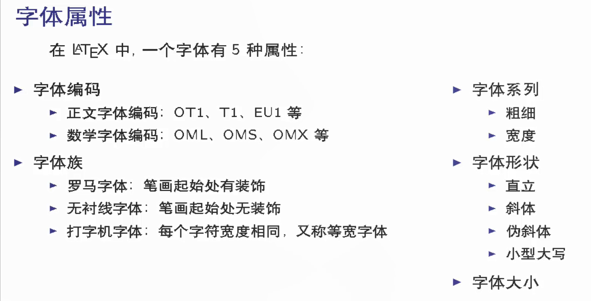
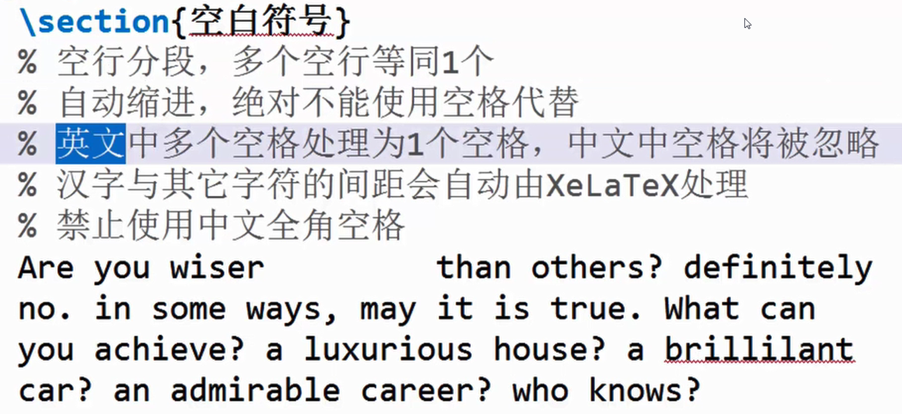

<!-- @import "[TOC]" {cmd="toc" depthFrom=1 depthTo=6 orderedList=false} -->

<!-- code_chunk_output -->

- [1. 学习笔记：latex中文教程-15集 从入门到精通包含各种latex操作](#1-学习笔记latex中文教程-15集-从入门到精通包含各种latex操作)
  - [1.1. latex源文件基本构成](#11-latex源文件基本构成)
  - [1.2. latex中的中文处理办法](#12-latex中的中文处理办法)
  - [1.3. Latex 字体设置](#13-latex-字体设置)
  - [1.4. LaTeX文档的基本结构](#14-latex文档的基本结构)
  - [1.5. LaTeX中的特殊字符](#15-latex中的特殊字符)
    - [空白字符](#空白字符)
- [2. 资料](#2-资料)
  - [2.1. 参考文档](#21-参考文档)

<!-- /code_chunk_output -->

# 1. 学习笔记：latex中文教程-15集 从入门到精通包含各种latex操作

- 视频地址：在bilibili可找到

## 1.1. latex源文件基本构成


```latex {.line-numbers}
%导言区
\documentclass{book} %article,book,report,letter , 可以通过修改文档类修改显示格式

% 标题
\title{My First Document}
\author{Me}
\date{\today}

%正文区
\begin{document}
\maketitle %输出标题
    hello world ! 

    % 单$模式包含的数学公式显示在当前行   
    let $f(x)$ be defined by the formular 
    $f(x)=3x^2+x-1$

    % 双$$模式包含的数学公式单独显示一行  
    let $f(x)$ be defined by the formular 
    $$f(x)=3x^2+x-1$$


\end{document}

```

## 1.2. latex中的中文处理办法

编码需要采用utf-8，解析引擎需要用xelatex

打开ctex说明文档：在命令行中输入:
> texdoc ctex

一份（不太）简短的 LATEX 2ε 介绍：
> texdoc lshort-zh

```latex {.line-numbers}
%导言区
\documentclass{book} %article,book,report,letter , 可以通过修改文档类修改显示格式

\usepackage{ctex} %ctex用于解析中文

\newcommand\degree{^\circ} %newcommand用于定义新的命令

% 标题
\title{杂谈勾股定理}
\author{张三}
\date{\today}

%正文区
\begin{document}
    \maketitle %输出标题

    设直角三角形 $ABC$ ,其中 $\angle C=90\degree$ , 则有：
    \begin{equation} % equation产生带编号的行间公式
        AB^2 = BC^2 + AC^2
    \end{equation}

\end{document}

```

```latex {.line-numbers}
%导言区
\documentclass{ctexbook} %ctexart、 ctexrep、 ctexbook ctexbeamer 直接调用ctex相关文档类也可以解析中文

%\usepackage{ctex} %ctex用于解析中文

\newcommand\degree{^\circ} %newcommand用于定义新的命令

% 标题
\title{杂谈勾股定理}
\author{张三}
\date{\today}

%正文区
\begin{document}
    \maketitle %输出标题

    设直角三角形 $ABC$ ,其中 $\angle C=90\degree$ , 则有：
    \begin{equation} % equation产生带编号的行间公式
        AB^2 = BC^2 + AC^2
    \end{equation}

\end{document}


```

## 1.3. Latex 字体设置

**字体属性**

{#fig:FontProperty}

示例：

```latex {.line-numbers}
%导言区
\documentclass[10pt]{book}%normalsize 为10磅

\usepackage{ctex} %ctex用于解析中文

%自定义myfont命令，实现格式与内容分析
\newcommand{\myfont}{\textit{\textbf{\textsf{Fancy Text}}}}

% 标题
\title{杂谈勾股定理}
\author{张三}
\date{\today}

%正文区
\begin{document}
    \maketitle %输出标题

    %字体族设置（罗马字体，无衬线字体，打字机字体）
    \textrm{Roman Family} %罗马字体
    \textsf{Sans serif family} %无衬线字体
    \texttt{typewriter family} %打字机字体

    \rmfamily Roman Family %声明后面的字体为罗马字体，与textrm功能类似
    \sffamily sans serif family
    \ttfamily typewriter family

    % 字体系列设置
    \textmd{Medium Series}
    \textbf{Boldface Series}

    \mdseries medium Series
    \bfseries boldface Series


    %字体形状设置(直立，斜体，伪斜体，小型大写)
    \textup{Upright Shape}
    \textit{Italic Shape}
    \textsl{Slanted Shape}
    \textsc{Small Caps Shape}

    \upshape upright shape

    %中文字体
    {\songti 宋体} \quad {\heiti 黑体} \quad {\fangsong 仿宋} \quad {\kaishu 楷书} \quad  

    中文字体的\textbf{粗体}与\textit{斜体}

    %字体大小（相对于normalsize而言，normalsize在文档类中声明）
    {\tiny Hello}\\
    {\scriptsize Hello}\\
    {\footnotesize Hello}\\
    {\small Hello}\\
    {\normalsize Hello}\\
    {\Large Hello}\\
    {\LARGE Hello}\\
    {\huge Hello}\\
    {\Huge Hello}\\

    %中文字号设置
    \zihao{-0} 你好
    \zihao{5} 你好

    %自定义命令
    \myfont
\end{document}


```

## 1.4. LaTeX文档的基本结构


```latex {.line-numbers}
%导言区
\documentclass{ctexbook}


\ctexset {
chapter = {
format = \raggedright,
},
section = {
name = {第,节},
number = \chinese{section},
}
}

%正文区
\begin{document}
    \tableofcontents

    \chapter{绪论}
    \section{引言}
    \section{试验方法}

    \chapter{分析}
    \section{实验结果}
    \subsection{title}
    \subsection{数据}
    \subsection{图表}
    \subsection{数据分析}
    \subsubsection{title}
    \subsubsection{结果}
    \subsubsection{数据分析}

    \chapter{总结}
    \section{结论}
    \section{致谢}

\end{document}
```

## 1.5. LaTeX中的特殊字符

### 空白字符
{#fig:BlankCharacter}


# 2. 资料

## 2.1. 参考文档

1. [LaTeX开源小屋](https://www.latexstudio.net/)