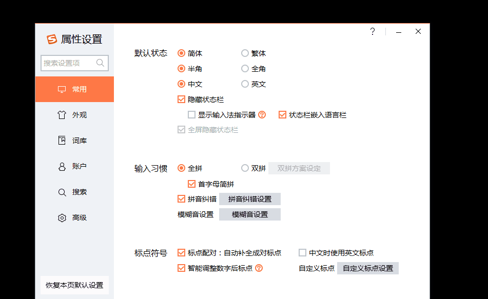

# SougouPinyin

### 自定义短语

搜狗拼音输入法支持自定义短语，配置方式如下：

{#fig:CustomPhrase}

常用短语如下所示：

```ini
jt,1=→
yw,1=//[??????]:
dc,1=【解决对策】：
sl,1=【解决思路】：
xm,1=【项目名称】：
xx,1=【现象描述】：
yy,1=【原因分析】：
zy,1=【注意事项】：
yh,1=///todo:待优化:
yz,1=///todo:待验证:
zs,1=///todo:待注释:
bx,1=///todo:待编写:
```
