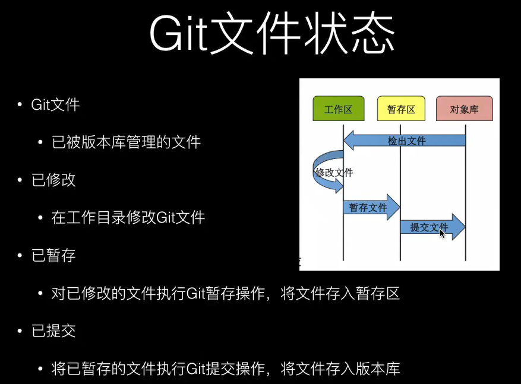
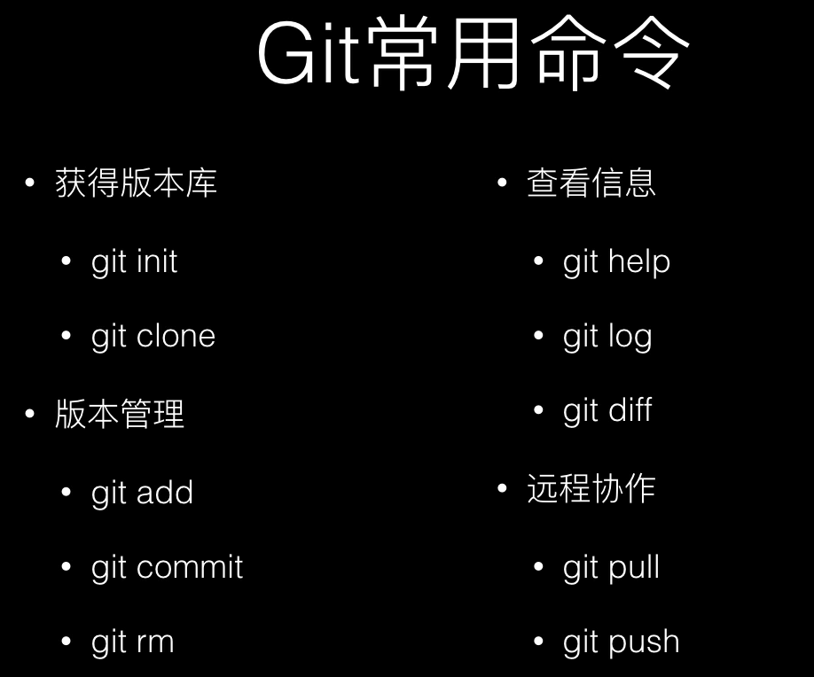

<!-- @import "[TOC]" {cmd="toc" depthFrom=1 depthTo=6 orderedList=false} -->

<!-- code_chunk_output -->

- [1. 入门](#1-入门)
    - [1.0.1. 创建文件夹](#101-创建文件夹)
    - [1.0.2. 创建分支](#102-创建分支)
    - [1.0.3. 合并分支](#103-合并分支)
    - [1.0.4. 删除分支](#104-删除分支)
- [2. 《深入理解git》](#2-深入理解git)
  - [2.1. S3 Git入门指引](#21-s3-git入门指引)
  - [2.2. S4 Git重要命令操练](#22-s4-git重要命令操练)
  - [2.3. S7 分支重要操作](#23-s7-分支重要操作)
  - [S8:分支进阶与版本回退](#s8分支进阶与版本回退)
  - [2.4. 常用命令](#24-常用命令)
    - [2.4.1. 查看git版本](#241-查看git版本)
    - [2.4.2. 查看文件列表](#242-查看文件列表)
  - [2.5. Mac操作](#25-mac操作)
- [3. FAQ](#3-faq)
  - [3.1. gitignore 文件不生效](#31-gitignore-文件不生效)
- [4. 相关资料](#4-相关资料)
  - [4.1. 参考文档](#41-参考文档)
  - [4.2. 相关软件](#42-相关软件)

<!-- /code_chunk_output -->

# 1. 入门

### 1.0.1. 创建文件夹

在commit时，git对空文件夹是忽略的，因此不能直接创建一个空文件夹，需要在文件夹里面添加文件后才能被git识别。

### 1.0.2. 创建分支

从develop分支创建一个feature分支

> git checkout -b feature develop

### 1.0.3. 合并分支

将feature分支合并到develop分支

> git checkout develop
> git merge --no-ff feature

参考：
[git-merge完全解析](https://www.jianshu.com/p/58a166f24c81)

### 1.0.4. 删除分支

项目初始，为了实现不同的功能，不同人员处理不同的功能，所以在git上创建了很多分支（branch）。对于git菜鸟，只会add branch 或者Git commit, 不会删除git分支也是一个烦恼。

- 删除本地分支：git branch -d 分支名称
- 强制删除本地分支：git branch -D 分支名称
- 删除远程分支：git push origin --delete 分支名称

> git branch -d developbranch
> git branch -D developbranch
> git push origin --delete developbranch

注意：删除分支就不可以撤销。删除分支前需要慎重。

# 2. 《深入理解git》

视频来源：哔哩哔哩
讲师：风中叶

## 2.1. S3 Git入门指引

文件的三种状态：

- 已修改(modified)
- 已暂存(staged)
- 已提交(committed)


{#fig:GitFileStatus}


## 2.2. S4 Git重要命令操练


{#fig:GitCommonCommand}

---

删除文件:

> rm -rf .git

递归删除.git文件夹下的所有文件

对于git工程，只有一个.git文件夹用于保存版本库信息，不像SVN在每个文件夹下都有一个.svn文件夹

---

回到上层目录：
> cd ..

--- 
创建文件：
> touch test.txt

--- 

查看文件内容：
> cat test.txt

--- 

查看工作区状态：
> git status

----
将文件添加到暂存区：

> git add test.txt

----

将文件从暂存区中删除：
> git rm --cached test.txt

---

查看提交历史：

> git log

---

git 的commitid是一个摘要，这个摘要值根据sha1计算出来的，

---

对于user.name与user.email来说有三个地方可以设置：

- /etc/gitconfig : 整个计算机的范围，也就是无论这台电脑有多少用户，都用这一个设置（几乎不会使用）,配置方式为：git config --system

- ~/.gitconfig : 用户主目录（经常使用）,配置方式为：git config --global

- 针对于特定项目的，在当前工程的.git/config文件中，配置方式为：git config --local

---

列出当前目录：
> pwd

---

丢弃掉上一次的修改

> git checkout --test.txt

---

提交

> git commit 
> git commit -m  //带提交信息

---

## 2.3. S7 分支重要操作


```bash {.line-numbers}
# 创建doe分支并切换到doe分支
git checkout -b doe 

# 查看readme.md文件的内容
cat README.md

# 用vi编辑器编辑readme.md
vi README.md

# 将doe分支合并到当前分支，例如当前在master分支，则会将doe合并到master分支上
01295@CY-20180208PUBU MINGW64 ~/temp/temp (master)
$ git merge doe

# 删除doe分支，只能删除已经合并的分支
$ git branch -d doe

# 显示日志
$ git log

# 显示最近3条日志
$ git log -3

# 显示各分支最近一次提交信息
$ git branch -v

# 将字符串hello Word 输出到文件hello.txt中，此操作会直接创建hello.txt
$ echo 'hello world' > hello.txt

# 进入.git子目录
$ cd .git

# 回到上一层目录
01295@CY-20180208PUBU MINGW64 ~/temp/temp/.git (GIT_DIR!)
$ cd ..

# 列出当前路径下的所有文件及文件夹
$ ls -al

# 查看HEAD文件的内容，需要先进入.git文件夹
$ cat HEAD
ref: refs/heads/master

# 将所有文件都添加到暂存区
$ git add .


```

HEAD：指向的是当前分支ls

## S8:分支进阶与版本回退


```bash {.line-numbers}

# 以图形化的方式查看log
$ git log --graph

# 返回到上一个分支
$ git checkout -

# add与commit合二为一
$ git commit -am 'add hello world to readme.md'

# commitID会采用缩写方式显示
$ git log --graph --abbrev-commit

# commit信息用单行的方式显示
# commitID会采用缩写方式显示
$ git log --graph --pretty=oneline --abbrev-commit

# 回退到上一个版本
$ git reset --hard HEAD^

# 回退两个版本
$ git reset --hard HEAD^^

# 回退到指定提交
# 格式：git reset --hard commitID简写
$ git reset --hard 47d3

# 回到之前的第n个提交
# 格式：git reset --hard HEAD~n
$ git reset --hard HEAD~3

# 显示操作日志
$ git reflog

```

## 2.4. 常用命令

### 2.4.1. 查看git版本

在cmd中输入：
> git --version

### 2.4.2. 查看文件列表

在git bash中输入：
> ls : 查看文件
> ls -al ：查看文件及其详细信息

## 2.5. Mac操作

命令行工具：
> bash : 自带的
> zsh ：强大但不宜用
> on my zsh  ： 强大美观易用

清屏：
> Ctrl+L 或者 clear


# 3. FAQ 

## 3.1. gitignore 文件不生效

.gitignore只能忽略那些原来没有被追踪的文件，如果某些文件已经被纳入了版本管理中，则修改.gitignore是无效的。那么解决方法就是先把本地缓存删除（改变成未被追踪状态），然后再提交：


```bash {.line-numbers}
git rm -r --cached .
git add .
git commit -m 'update .gitignore'
```


# 4. 相关资料

## 4.1. 参考文档
1. [git官网](http://www.git-scm.com)
1. [Git分支管理策略](http://www.ruanyifeng.com/blog/2012/07/git.html)
1. [官方图书和文档](https://git-scm.com/book/zh/v2)
1. [菜鸟教程](https://www.runoob.com/git/git-tutorial.html)
1. [廖雪峰的博客](https://www.liaoxuefeng.com/wiki/896043488029600)
1. [图解git](http://marklodato.github.io/visual-git-guide/index-zh-cn.html?no-svg)
1. [动画学git](https://learngitbranching.js.org/)

## 4.2. 相关软件

- GIT客户端：[SourceTree](https://www.sourcetreeapp.com/) 颜值高，功能非常强大
- GIT客户端：[Tower Pro](https://www.git-tower.com/) 颜值高，功能非常强大

