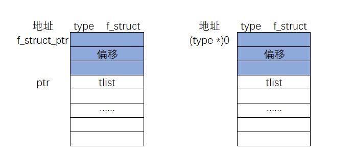
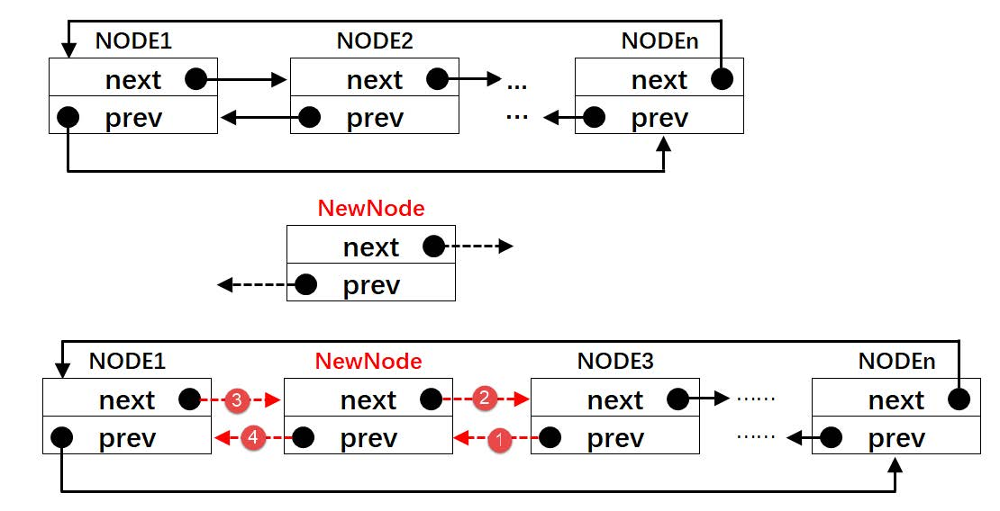
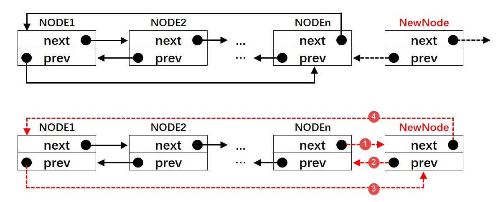
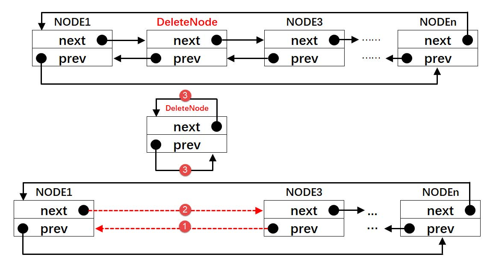

[toc]

# 待研究

- rt_hw_context_switch函数研究
- rt_hw_context_switch_interrupt 函数研究
- thread->tlist里面保存的是什么？


# 代码分析

## rt_sem_take

### 流程

```c {.line-numbers}

关闭全局中断
if (当前信号量值>0)
{
    信号量值减1
    打开全局中断
    函数返回RT_EOK
}
else 
{
    if (等待时间==0)
    {
        打开全局中断
        函数返回-RT_ETIMEOUT
    }
    else
    {
        判断是否是在中断环境，如果是在中断环境，则报错
        获取当前线程
        重置当前线程错误码为RT_EOK
        挂起当前线程，并将当前线程插入到此sem等待线程列表中
        if (等待时间>0)
        {
            根据等待时间设置当前线程的定时器，并启动定时器
        }
        使能全局中断
        进行一次线程调度
    }
}

```

### 源码

```c {.line-numbers}
rt_err_t rt_sem_take(rt_sem_t sem, rt_int32_t time)
{
    // typedef long rt_base_t;
    register rt_base_t temp;
    struct rt_thread *thread;

    RT_ASSERT(sem != RT_NULL);

// #define RT_OBJECT_HOOK_CALL(func, argv) \
//    do { if ((func) != RT_NULL) func argv; } while (0)
//rt_object_trytake_hook(&(sem->parent.parent))
//程序中rt_object_trytake_hook为RT_NULL
    RT_OBJECT_HOOK_CALL(rt_object_trytake_hook, (&(sem->parent.parent)));

    /* disable interrupt */
    temp = rt_hw_interrupt_disable();

    RT_DEBUG_LOG(RT_DEBUG_IPC, ("thread %s take sem:%s, which value is: %d\n",
                                rt_thread_self()->name,
                                ((struct rt_object *)sem)->name,
                                sem->value));

    if (sem->value > 0)
    {
        /* semaphore is available */
        sem->value --;

        /* enable interrupt */
        rt_hw_interrupt_enable(temp);
    }
    else
    {
        /* no waiting, return with timeout */
        if (time == 0)
        {
            rt_hw_interrupt_enable(temp);

            return -RT_ETIMEOUT;
        }
        else
        {
            /* current context checking */
            RT_DEBUG_IN_THREAD_CONTEXT;

            /* semaphore is unavailable, push to suspend list */
            /* get current thread */
            thread = rt_thread_self();

            /* reset thread error number */
            thread->error = RT_EOK;

            RT_DEBUG_LOG(RT_DEBUG_IPC, ("sem take: suspend thread - %s\n",
                                        thread->name));

            /* suspend thread */
            // 将当前线程挂起，并将其插入到此sem的等待线程列表中
            rt_ipc_list_suspend(&(sem->parent.suspend_thread),
                                thread,
                                sem->parent.parent.flag);

            /* has waiting time, start thread timer */
            if (time > 0)
            {
                RT_DEBUG_LOG(RT_DEBUG_IPC, ("set thread:%s to timer list\n",
                                            thread->name));

                /* reset the timeout of thread timer and start it */
                rt_timer_control(&(thread->thread_timer),
                                 RT_TIMER_CTRL_SET_TIME,
                                 &time);
                rt_timer_start(&(thread->thread_timer));
            }

            /* enable interrupt */
            rt_hw_interrupt_enable(temp);

            /* do schedule */
            rt_schedule();

            if (thread->error != RT_EOK)
            {
                return thread->error;
            }
        }
    }

    RT_OBJECT_HOOK_CALL(rt_object_take_hook, (&(sem->parent.parent)));

    return RT_EOK;
}

```

### rt_object_trytake_hook


```c {.line-numbers}

void (*rt_object_trytake_hook)(struct rt_object *object);
```

### rt_object_trytake_sethook

此函数未被任何地方调用，因此rt_object_trytake_hook=RT_NULL

```c {.line-numbers}
/**
 * This function will set a hook function, which will be invoked when object
 * is taken from kernel object system.
 *
 * The object is taken means:
 * semaphore - semaphore is taken by thread
 * mutex - mutex is taken by thread
 * event - event is received by thread
 * mailbox - mail is received by thread
 * message queue - message is received by thread
 *
 * @param hook the hook function
 */
void rt_object_trytake_sethook(void (*hook)(struct rt_object *object))
{
    rt_object_trytake_hook = hook;
}

```


### rt_ipc_list_suspend


```c {.line-numbers}
/**
 * This function will suspend a thread to a specified list. IPC object or some
 * double-queue object (mailbox etc.) contains this kind of list.
 *
 * @param list the IPC suspended thread list
 * @param thread the thread object to be suspended
 * @param flag the IPC object flag,
 *        which shall be RT_IPC_FLAG_FIFO/RT_IPC_FLAG_PRIO.
 *
 * @return the operation status, RT_EOK on successful
 */
rt_inline rt_err_t rt_ipc_list_suspend(rt_list_t        *list,
                                       struct rt_thread *thread,
                                       rt_uint8_t        flag)
{
    /* suspend thread */
    rt_thread_suspend(thread);

    switch (flag)
    {
    case RT_IPC_FLAG_FIFO:
        rt_list_insert_before(list, &(thread->tlist));
        break;

    case RT_IPC_FLAG_PRIO:
        {
            struct rt_list_node *n;
            struct rt_thread *sthread;

            /* find a suitable position */
            for (n = list->next; n != list; n = n->next)
            {
                sthread = rt_list_entry(n, struct rt_thread, tlist);

                /* find out */
                if (thread->current_priority < sthread->current_priority)
                {
                    /* insert this thread before the sthread */
                    rt_list_insert_before(&(sthread->tlist), &(thread->tlist));
                    break;
                }
            }

            /*
             * not found a suitable position,
             * append to the end of suspend_thread list
             */
            if (n == list)
                rt_list_insert_before(list, &(thread->tlist));
        }
        break;
    }

    return RT_EOK;
}

```

## rt_sem_init


```c {.line-numbers}
/**
 * This function will initialize a semaphore and put it under control of
 * resource management.
 *
 * @param sem the semaphore object
 * @param name the name of semaphore
 * @param value the init value of semaphore
 * @param flag the flag of semaphore
 *
 * @return the operation status, RT_EOK on successful
 */
rt_err_t rt_sem_init(rt_sem_t    sem,
                     const char *name,
                     rt_uint32_t value,
                     rt_uint8_t  flag,const char *file,rt_uint16_t line)
{
    RT_ASSERT(sem != RT_NULL);
    
//    if(((struct rt_object *)sem)->name[0] != 0) 
//    {
//        rt_kprintf("error : Sem : %s Already Inited \n",((struct rt_object *)sem)->name);
//        rt_kprintf("[file] %s \n",file);
//        rt_kprintf("[line] %d \n",line);
//        while(1) rt_thread_delay(10);
//    }
    
    /* init object */
    rt_object_init(&(sem->parent.parent), RT_Object_Class_Semaphore, name);

    /* init ipc object */
    rt_ipc_object_init(&(sem->parent));

    /* set init value */
    sem->value = value;

    /* set parent */
    sem->parent.parent.flag = flag;

    return RT_EOK;
}
```

### rt_object_init

流程：

```c {.line-numbers}
将object->type设置为静态的
将name保存到object->name中
将object->list插入到rt_object_container对应的链表中
```

源码：

```c {.line-numbers}
/**
 * This function will initialize an object and add it to object system
 * management.
 *
 * @param object the specified object to be initialized.
 * @param type the object type.
 * @param name the object name. In system, the object's name must be unique.
 */
void rt_object_init(struct rt_object         *object,
                    enum rt_object_class_type type,
                    const char               *name)
{
    register rt_base_t temp;
    struct rt_object_information *information;

#ifdef RT_USING_MODULE
    /* get module object information */
    information = (rt_module_self() != RT_NULL) ?
        &rt_module_self()->module_object[type] : &rt_object_container[type];
#else
    /* get object information */
    information = &rt_object_container[type];
#endif

    /* initialize object's parameters */

    /* set object type to static */
    object->type = type | RT_Object_Class_Static;

    /* copy name */
    rt_strncpy(object->name, name, RT_NAME_MAX);

    RT_OBJECT_HOOK_CALL(rt_object_attach_hook, (object));

    /* lock interrupt */
    temp = rt_hw_interrupt_disable();

    /* insert object into information object list */
    rt_list_insert_after(&(information->object_list), &(object->list));

    /* unlock interrupt */
    rt_hw_interrupt_enable(temp);
}
```

### rt_object_container


```c {.line-numbers}
#define _OBJ_CONTAINER_LIST_INIT(c)     \
    {&(rt_object_container[c].object_list), &(rt_object_container[c].object_list)}
struct rt_object_information rt_object_container[RT_Object_Class_Unknown] =
{
    /* initialize object container - thread */
    {RT_Object_Class_Thread, _OBJ_CONTAINER_LIST_INIT(RT_Object_Class_Thread), sizeof(struct rt_thread)},
#ifdef RT_USING_SEMAPHORE
    /* initialize object container - semaphore */
    {RT_Object_Class_Semaphore, _OBJ_CONTAINER_LIST_INIT(RT_Object_Class_Semaphore), sizeof(struct rt_semaphore)},
#endif
#ifdef RT_USING_MUTEX
    /* initialize object container - mutex */
    {RT_Object_Class_Mutex, _OBJ_CONTAINER_LIST_INIT(RT_Object_Class_Mutex), sizeof(struct rt_mutex)},
#endif
#ifdef RT_USING_EVENT
    /* initialize object container - event */
    {RT_Object_Class_Event, _OBJ_CONTAINER_LIST_INIT(RT_Object_Class_Event), sizeof(struct rt_event)},
#endif
#ifdef RT_USING_MAILBOX
    /* initialize object container - mailbox */
    {RT_Object_Class_MailBox, _OBJ_CONTAINER_LIST_INIT(RT_Object_Class_MailBox), sizeof(struct rt_mailbox)},
#endif
#ifdef RT_USING_MESSAGEQUEUE
    /* initialize object container - message queue */
    {RT_Object_Class_MessageQueue, _OBJ_CONTAINER_LIST_INIT(RT_Object_Class_MessageQueue), sizeof(struct rt_messagequeue)},
#endif
#ifdef RT_USING_MEMHEAP
    /* initialize object container - memory heap */
    {RT_Object_Class_MemHeap, _OBJ_CONTAINER_LIST_INIT(RT_Object_Class_MemHeap), sizeof(struct rt_memheap)},
#endif
#ifdef RT_USING_MEMPOOL
    /* initialize object container - memory pool */
    {RT_Object_Class_MemPool, _OBJ_CONTAINER_LIST_INIT(RT_Object_Class_MemPool), sizeof(struct rt_mempool)},
#endif
#ifdef RT_USING_DEVICE
    /* initialize object container - device */
    {RT_Object_Class_Device, _OBJ_CONTAINER_LIST_INIT(RT_Object_Class_Device), sizeof(struct rt_device)},
#endif
    /* initialize object container - timer */
    {RT_Object_Class_Timer, _OBJ_CONTAINER_LIST_INIT(RT_Object_Class_Timer), sizeof(struct rt_timer)},
#ifdef RT_USING_MODULE
    /* initialize object container - module */
    {RT_Object_Class_Module, _OBJ_CONTAINER_LIST_INIT(RT_Object_Class_Module), sizeof(struct rt_module)},
#endif
};


// 以RT_Object_Class_Thread为例进行扩展

struct rt_object_information rt_object_container[RT_Object_Class_Unknown] =
{
    /* initialize object container - thread */
    {RT_Object_Class_Thread, _OBJ_CONTAINER_LIST_INIT(RT_Object_Class_Thread), sizeof(struct rt_thread)},
// ....
};

// --->

struct rt_object_information rt_object_container[RT_Object_Class_Unknown] =
{
    /* initialize object container - thread */
    {RT_Object_Class_Thread, {&(rt_object_container[0].object_list), &(rt_object_container[0].object_list)}, sizeof(struct rt_thread)},
// ....
};


// --->
// 将object_list的next和prev指针都指向自身
struct rt_object_information rt_object_container[RT_Object_Class_Unknown] =
{
    /* initialize object container - thread */
    {RT_Object_Class_Thread, {.object_list->next=&(rt_object_container[0].object_list), .object_list->prev=&(rt_object_container[0].object_list)}, sizeof(struct rt_thread)},
// ....
};

//TODO : 做实验看下object_list、object_list->next 、object_list->prev分别是什么

```

### rt_ipc_object_init

```c {.line-numbers}
/**
 * This function will initialize an IPC object
 *
 * @param ipc the IPC object
 *
 * @return the operation status, RT_EOK on successful
 */
rt_inline rt_err_t rt_ipc_object_init(struct rt_ipc_object *ipc)
{
    /* init ipc object */
    rt_list_init(&(ipc->suspend_thread));

    return RT_EOK;
}
```


## rt_schedule

### 流程


```c {.line-numbers}
关闭全局中断
if (rt_scheduler_lock_nest == 0) 线程调度锁
{

}
打开全局中断
```


### 源码

```c {.line-numbers}

/**
 * This function will perform one schedule. It will select one thread
 * with the highest priority level, then switch to it.
 */
void rt_schedule(void)
{
    rt_base_t level;
    struct rt_thread *to_thread;
    struct rt_thread *from_thread;

    /* disable interrupt */
    level = rt_hw_interrupt_disable();

    /* check the scheduler is enabled or not */
    if (rt_scheduler_lock_nest == 0)
    {
        register rt_ubase_t highest_ready_priority;

#if RT_THREAD_PRIORITY_MAX <= 32
        highest_ready_priority = __rt_ffs(rt_thread_ready_priority_group) - 1;
#else
        register rt_ubase_t number;

        number = __rt_ffs(rt_thread_ready_priority_group) - 1;
        highest_ready_priority = (number << 3) + __rt_ffs(rt_thread_ready_table[number]) - 1;
#endif

        /* get switch to thread */
        to_thread = rt_list_entry(rt_thread_priority_table[highest_ready_priority].next,
                                  struct rt_thread,
                                  tlist);

        /* if the destination thread is not the same as current thread */
        if (to_thread != rt_current_thread)
        {
            rt_current_priority = (rt_uint8_t)highest_ready_priority;
            from_thread         = rt_current_thread;
            rt_current_thread   = to_thread;

            RT_OBJECT_HOOK_CALL(rt_scheduler_hook, (from_thread, to_thread));

            /* switch to new thread */
            RT_DEBUG_LOG(RT_DEBUG_SCHEDULER,
                         ("[%d]switch to priority#%d "
                          "thread:%.*s(sp:0x%p), "
                          "from thread:%.*s(sp: 0x%p)\n",
                          rt_interrupt_nest, highest_ready_priority,
                          RT_NAME_MAX, to_thread->name, to_thread->sp,
                          RT_NAME_MAX, from_thread->name, from_thread->sp));

#ifdef RT_USING_OVERFLOW_CHECK
            _rt_scheduler_stack_check(to_thread);
#endif

            if (rt_interrupt_nest == 0)
            {
                rt_hw_context_switch((rt_uint32_t)&from_thread->sp,
                                     (rt_uint32_t)&to_thread->sp);
            }
            else
            {
                RT_DEBUG_LOG(RT_DEBUG_SCHEDULER, ("switch in interrupt\n"));

                rt_hw_context_switch_interrupt((rt_uint32_t)&from_thread->sp,
                                               (rt_uint32_t)&to_thread->sp);
            }
        }
    }

    /* enable interrupt */
    rt_hw_interrupt_enable(level);
}

```

### __rt_ffs

此函数的功能是获取 rt_thread_ready_priority_group 第一个为1的位号。rt_schedule对其调用的方式如下：

```c {.line-numbers}
highest_ready_priority = __rt_ffs(rt_thread_ready_priority_group) - 1;
```

- 当rt_thread_ready_priority_group=0b'0000 0000 1001 0001时，也就是bit0,bit4,bit7为1，则返回值highest_ready_priority为1，__rt_ffs只要找到首个为1的bit就返回
 
- 当rt_thread_ready_priority_group=0b'0000 0000 1001 0000时，也就是bit4,bit7为1，则返回值highest_ready_priority为5，__rt_ffs只要找到首个为1的bit就返回

- 当rt_thread_ready_priority_group=0b'0000 0000 1000 0000时，也就是bit7为1，则返回值highest_ready_priority为8，__rt_ffs只要找到首个为1的bit就返回


```c {.line-numbers}

/**
 * This function finds the first bit set (beginning with the least significant bit)
 * in value and return the index of that bit.
 *
 * Bits are numbered starting at 1 (the least significant bit).  A return value of
 * zero from any of these functions means that the argument was zero.
 *
 * @return return the index of the first bit set. If value is 0, then this function
 * shall return 0.
 */
int __rt_ffs(int value)
{
// 此函数的返回值不可能为0，因为当所有线程都没有运行时，空闲线程还在运行
    if (value == 0) return 0;

// 当bit0~bit7中存在置1的位时，则返回位号
// 若bit0~bit7中不存在置1的位时，则函数继续向下运行
    if (value & 0xff)
        return __lowest_bit_bitmap[value & 0xff] + 1;

// 当bit0~bit7中不存在置1的位时，则查找bit8~bit15中是否存在置1的位，如果存在，则返回位号
// 如果bit8~bit15中不存在置1的位，则函数继续向后面运行
    if (value & 0xff00)
        return __lowest_bit_bitmap[(value & 0xff00) >> 8] + 9;

// 当bit0~bit15中不存在置1的位时，则查找bit16~bit23中是否存在置1的位，如果存在，则返回位号
// 如果bit16~bit23不存在置1的位，则函数继续向后面运行
    if (value & 0xff0000)
        return __lowest_bit_bitmap[(value & 0xff0000) >> 16] + 17;

// 当bit0~bit23中不存在置1的位时，则查找bit24~bit31中是否存在置1的位，如果存在则返回位号
// 如果bit24~bit31中不存在置1的位，则函数直接返回
    return __lowest_bit_bitmap[(value & 0xff000000) >> 24] + 25;
}
```


### rt_thread_ready_priority_group


```c {.line-numbers}
#if RT_THREAD_PRIORITY_MAX > 32
/* Maximum priority level, 256 */
rt_uint32_t rt_thread_ready_priority_group;
rt_uint8_t rt_thread_ready_table[32];
#else
/* Maximum priority level, 32 */
rt_uint32_t rt_thread_ready_priority_group;
#endif

```

以最大优先级为32进行分析：

rt_thread_ready_priority_group 存放的是，哪个优先级中有就绪的线程，每一位代表一个优先级。

- 假如rt_thread_ready_priority_group的bit0为1，则说明优先级为0的线程中有一个或者若干个处于就绪状态，
- 假如bit10为1，则说明优先级为10的线程中有一个或者若干个处于就绪状态，
- 假如bit30为1，则说明优先级为30的线程中有一个或者若干个处于就绪状态。

也就是说rt_thread_ready_priority_group的每一位代表当前优先级是否有就绪线程。

### __lowest_bit_bitmap

此数组在__rt_ffs函数中的调用方式如下所示：

```c {.line-numbers}
    if (value & 0xff)
        return __lowest_bit_bitmap[value & 0xff] + 1;
```

__rt_ffs在rt_schedule中的调用方式如下:

```c {.line-numbers}
highest_ready_priority = __rt_ffs(rt_thread_ready_priority_group) - 1;
```

- 当rt_thread_ready_priority_group=1=0b'0000 0000 0000 0001时，说明优先级0存在就绪的线程，即highest_ready_priority = 0 ，则 highest_ready_priority = __rt_ffs(rt_thread_ready_priority_group) - 1 = __lowest_bit_bitmap[value & 0xff] + 1  -1 = __lowest_bit_bitmap[1]=0
- rt_thread_ready_priority_group=2=0b'0000 0000 0000 0010时，优先级1存在就绪线程，最高优先级为1，则__lowest_bit_bitmap[2]的值需要等于最高优先级的值即1
- rt_thread_ready_priority_group=3=0b'0000 0000 0000 0011时，优先级0和1存在就绪线程，最高优先级为0，则__lowest_bit_bitmap[3]的值需要等于最高优先级的值即0
- rt_thread_ready_priority_group=4=0b'0000 0000 0000 0100时，优先级2存在就绪线程，最高优先级为2，则__lowest_bit_bitmap[4]的值需要等于最高优先级的值即2
- rt_thread_ready_priority_group=5=0b'0000 0000 0000 0101时，优先级0和2存在就绪线程，最高优先级为0，则__lowest_bit_bitmap[5]的值需要等于最高优先级的值即0
- rt_thread_ready_priority_group=6=0b'0000 0000 0000 0110时，优先级1和2存在就绪线程，最高优先级为1，则__lowest_bit_bitmap[6]的值需要等于最高优先级的值即1
- rt_thread_ready_priority_group=7=0b'0000 0000 0000 0111时，优先级0,1,2存在就绪线程，最高优先级为0，则__lowest_bit_bitmap[7]的值需要等于最高优先级的值即0

依次类推，rt_thread_ready_priority_group的值为value(0 ~ 255)，存在就绪线程的最高优先级为N(0~7)时，__lowest_bit_bitmap[value]需要等于N，当rt_thread_ready_priority_group>255时，可以参考 __rt_ffs 函数进行移位操作

```c {.line-numbers}
const rt_uint8_t __lowest_bit_bitmap[] =
{
    /*取最低位为1的bit位号  
        __lowest_bit_bitmap[0b'xxxx xxx1]=0
        __lowest_bit_bitmap[0b'xxxx xx10]=1
        __lowest_bit_bitmap[0b'xxxx x100]=2
        __lowest_bit_bitmap[0b'xxxx 1000]=3
        __lowest_bit_bitmap[0b'xxx1 0000]=4
        __lowest_bit_bitmap[0b'xx10 0000]=5
        __lowest_bit_bitmap[0b'x100 0000]=6
        __lowest_bit_bitmap[0b'1000 0000]=7
    */
    /*       x0 x1 x2 x3 x4 x5 x6 x7 x8 x9 xA xB xC xD xE xF */
    /* 0x */ 0, 0, 1, 0, 2, 0, 1, 0, 3, 0, 1, 0, 2, 0, 1, 0,
    /* 1x */ 4, 0, 1, 0, 2, 0, 1, 0, 3, 0, 1, 0, 2, 0, 1, 0,
    /* 2x */ 5, 0, 1, 0, 2, 0, 1, 0, 3, 0, 1, 0, 2, 0, 1, 0,
    /* 3x */ 4, 0, 1, 0, 2, 0, 1, 0, 3, 0, 1, 0, 2, 0, 1, 0,
    /* 4x */ 6, 0, 1, 0, 2, 0, 1, 0, 3, 0, 1, 0, 2, 0, 1, 0,
    /* 5x */ 4, 0, 1, 0, 2, 0, 1, 0, 3, 0, 1, 0, 2, 0, 1, 0,
    /* 6x */ 5, 0, 1, 0, 2, 0, 1, 0, 3, 0, 1, 0, 2, 0, 1, 0,
    /* 7x */ 4, 0, 1, 0, 2, 0, 1, 0, 3, 0, 1, 0, 2, 0, 1, 0,
    /* 8x */ 7, 0, 1, 0, 2, 0, 1, 0, 3, 0, 1, 0, 2, 0, 1, 0,
    /* 9x */ 4, 0, 1, 0, 2, 0, 1, 0, 3, 0, 1, 0, 2, 0, 1, 0,
    /* Ax */ 5, 0, 1, 0, 2, 0, 1, 0, 3, 0, 1, 0, 2, 0, 1, 0,
    /* Bx */ 4, 0, 1, 0, 2, 0, 1, 0, 3, 0, 1, 0, 2, 0, 1, 0,
    /* Cx */ 6, 0, 1, 0, 2, 0, 1, 0, 3, 0, 1, 0, 2, 0, 1, 0,
    /* Dx */ 4, 0, 1, 0, 2, 0, 1, 0, 3, 0, 1, 0, 2, 0, 1, 0,
    /* Ex */ 5, 0, 1, 0, 2, 0, 1, 0, 3, 0, 1, 0, 2, 0, 1, 0,
    /* Fx */ 4, 0, 1, 0, 2, 0, 1, 0, 3, 0, 1, 0, 2, 0, 1, 0
};

```

### rt_thread_priority_table

rt_list_t rt_thread_priority_table[RT_THREAD_PRIORITY_MAX];


### rt_list_entry

rt_list_entry()是一个已知一个结构体里面的成员的地址，反推出该结构体的首地址的宏

```c {.line-numbers}
/**
 * @brief get the struct for this entry
 * @param node the entry point
 * @param type the type of structure
 * @param member the name of list in structure
 */
#define rt_list_entry(node, type, member) \
    ((type *)((char *)(node) - (unsigned long)(&((type *)0)->member)))

/*@}*/
```

{#fig:rt_list_entry}

我们知道了一个节点tlist的地址ptr，现在要推算出该节点所在的type 类型的结构体的起始地址f_struct_ptr。我们可以将ptr的值减去图中灰色部分的偏移的大小就可以得到f_struct_ptr的地址，现在的关键是如何计算出灰色部分的偏移大小。这里采取的做法是将0地址强制类型类型转换为type，即(type *)0，然后通过指针访问结构体成员的方式获取到偏移的大小，即(&((type *)0)->member)，最后即可算出f_struct_ptr = ptr - (&((type *)0)->member)


```c {.line-numbers}
to_thread = rt_list_entry(rt_thread_priority_table[highest_ready_priority].next,
                                  struct rt_thread,
                                  tlist);
// 展开之后为

to_thread = ((struct rt_thread *)((char *)(rt_thread_priority_table[highest_ready_priority].next) - (unsigned long)(&((struct rt_thread *)0)->tlist)))
```

### _rt_scheduler_stack_check

流程

```c {.line-numbers}

if(thread->sp不在线程栈空间内)
{
    打印stack overflow
}
else if(thread->sp在线程栈的最后四个字节)
{
    打印线程栈即将用完
}

```

代码

```c {.line-numbers}
static void _rt_scheduler_stack_check(struct rt_thread *thread)
{
    RT_ASSERT(thread != RT_NULL);

    if ((rt_uint32_t)thread->sp <= (rt_uint32_t)thread->stack_addr ||
        (rt_uint32_t)thread->sp >
        (rt_uint32_t)thread->stack_addr + (rt_uint32_t)thread->stack_size)
    {
        rt_uint32_t level;

        rt_kprintf("thread:%s stack overflow\n", thread->name);
        #ifdef RT_USING_FINSH
        {
            extern long list_thread(void);
            list_thread();
        }
        #endif
        level = rt_hw_interrupt_disable();
        while (level);
    }
    else if ((rt_uint32_t)thread->sp <= ((rt_uint32_t)thread->stack_addr + 32))
    {
        rt_kprintf("warning: %s stack is close to end of stack address.\n",
                   thread->name);
    }
}
```

### rt_hw_context_switch

## rt_thread_init

流程：


```c {.line-numbers}
初始化thread对应的object对象
调用_rt_thread_init进行初始化
```

源码：

```c {.line-numbers}
/**
 * This function will initialize a thread, normally it's used to initialize a
 * static thread object.
 *
 * @param thread the static thread object
 * @param name the name of thread, which shall be unique
 * @param entry the entry function of thread
 * @param parameter the parameter of thread enter function
 * @param stack_start the start address of thread stack
 * @param stack_size the size of thread stack
 * @param priority the priority of thread
 * @param tick the time slice if there are same priority thread
 *
 * @return the operation status, RT_EOK on OK, -RT_ERROR on error
 */
rt_err_t rt_thread_init(struct rt_thread *thread,
                        const char       *name,
                        void (*entry)(void *parameter),
                        void             *parameter,
                        void             *stack_start,
                        rt_uint32_t       stack_size,
                        rt_uint8_t        priority,
                        rt_uint32_t       tick)
{
    /* thread check */
    RT_ASSERT(thread != RT_NULL);
    RT_ASSERT(stack_start != RT_NULL);

    /* init thread object */
    rt_object_init((rt_object_t)thread, RT_Object_Class_Thread, name);

    return _rt_thread_init(thread,
                           name,
                           entry,
                           parameter,
                           stack_start,
                           stack_size,
                           priority,
                           tick);
}
```

### _rt_thread_init

流程：

```c {.line-numbers}
初始化thread->tlist
将输入参数entry赋值给thread->entry
将输入参数parameter赋值给thread->parameter
将输入参数stack_start赋值给thread->stack_addr
将输入参数stack_size赋值给thread->stack_size
将栈空间thread->stack_addr全部初始化为'#'
调用rt_hw_stack_init函数为thread->sp赋值
将输入参数priority赋值给thread->init_priority和thread->current_priority
将输入参数tick赋值给thread->init_tick和thread->remaining_tick
将RT_EOK赋值给thread->error
将RT_THREAD_INIT赋值给thread->stat
将thread->cleanup和thread->user_data赋值为0
调用rt_timer_init初始化thread->thread_timer
```

源码：

```c {.line-numbers}
static rt_err_t _rt_thread_init(struct rt_thread *thread,
                                const char       *name,
                                void (*entry)(void *parameter),
                                void             *parameter,
                                void             *stack_start,
                                rt_uint32_t       stack_size,
                                rt_uint8_t        priority,
                                rt_uint32_t       tick)
{
    /* init thread list */
    rt_list_init(&(thread->tlist));

    thread->entry = (void *)entry;
    thread->parameter = parameter;

    /* stack init */
    thread->stack_addr = stack_start;
    thread->stack_size = (rt_uint16_t)stack_size;

    /* init thread stack */
    rt_memset(thread->stack_addr, '#', thread->stack_size);
    thread->sp = (void *)rt_hw_stack_init(thread->entry, thread->parameter,
        (void *)((char *)thread->stack_addr + thread->stack_size - 4),
        (void *)rt_thread_exit);

    /* priority init */
    RT_ASSERT(priority < RT_THREAD_PRIORITY_MAX);
    thread->init_priority    = priority;
    thread->current_priority = priority;

    /* tick init */
    thread->init_tick      = tick;
    thread->remaining_tick = tick;

    /* error and flags */
    thread->error = RT_EOK;
    thread->stat  = RT_THREAD_INIT;

    /* initialize cleanup function and user data */
    thread->cleanup   = 0;
    thread->user_data = 0;

    /* init thread timer */
    rt_timer_init(&(thread->thread_timer),
                  thread->name,
                  rt_thread_timeout,
                  thread,
                  0,
                  RT_TIMER_FLAG_ONE_SHOT);

    return RT_EOK;
}

```

### rt_hw_stack_init

流程：

```c {.line-numbers}
获取栈顶指针stk的值
让栈顶指针stk进行8字节对齐，以便兼容浮点数运算
让栈顶指针stk向下偏移sizeof(struct stack_frame)个字节
将栈顶指针赋值给struct stack_frame类型的局部指针变量 stack_frame 
将stack_frame对应的空间初始化为0xdeadbeef
将输入参数parameter赋值给r0寄存器
将输入参数texit赋值给lr寄存器
将输入参数tentry赋值给pc寄存器
将0x01000000L赋值给psr寄存器
返回栈顶指针stk
```


源码：

~~~c {.line-numbers}
rt_uint8_t *rt_hw_stack_init(void       *tentry,
                             void       *parameter,
                             rt_uint8_t *stack_addr, /*线程栈顶地址-4*/
                             void       *texit)
{
    struct stack_frame *stack_frame;
    rt_uint8_t         *stk;
    unsigned long       i;

// 获取栈顶地址，rt_hw_stack_init 在调用的时候，传给 stack_addr 的是(栈顶指针-4)
    stk  = stack_addr + sizeof(rt_uint32_t);

// 让stk这个指针向下8个字节对齐，确保stk是8字节对齐的地址。
// 在Cortex-M3（Cortex-M4或Cortex-M7）内核的单片机中，因为总线宽度是32位的，
// 通常只要栈保持4字节对齐就行，可这样为啥要8字节？难道有哪些操作是64位的？
// 确实有，那就是浮点运算，所以要8字节对齐（但是目前我们都还没有涉及到浮点运算，
// 只是为了后续兼容浮点运行的考虑）。如果栈顶指针是8字节对齐的，
// 在进行向下8字节对齐的时候，指针不会移动，如果不是8字节对齐的，
// 在做向下8字节对齐的时候，就会空出几个字节，不会使用，比如当stk是33，
// 明显不能整除8，进行向下8字节对齐就是32，那么就会空出一个字节不使用
    stk  = (rt_uint8_t *)RT_ALIGN_DOWN((rt_uint32_t)stk, 8);

//stk指针继续向下偏移sizeof(struct stack_frame)个地址 
    stk -= sizeof(struct stack_frame);

// 将stk指针强制转化为stack_frame类型后存到stack_frame
    stack_frame = (struct stack_frame *)stk;

//以stack_frame为起始地址，将栈空间里面的sizeof(struct stack_frame)个内存初始化为0xdeadbeef
// stack_frame里面保存的是r4-r11,r0-r3,r12,lr,pc,psr寄存器
    for (i = 0; i < sizeof(struct stack_frame) / sizeof(rt_uint32_t); i ++)
    {
        ((rt_uint32_t *)stack_frame)[i] = 0xdeadbeef;
    }

// 初始化异常发生时需要自动保存的寄存器
    stack_frame->exception_stack_frame.r0  = (unsigned long)parameter; /* r0 : argument */
    stack_frame->exception_stack_frame.r1  = 0;                        /* r1 */
    stack_frame->exception_stack_frame.r2  = 0;                        /* r2 */
    stack_frame->exception_stack_frame.r3  = 0;                        /* r3 */
    stack_frame->exception_stack_frame.r12 = 0;                        /* r12 */
    stack_frame->exception_stack_frame.lr  = (unsigned long)texit;     /* lr */
    stack_frame->exception_stack_frame.pc  = (unsigned long)tentry;    /* entry point, pc */
    stack_frame->exception_stack_frame.psr = 0x01000000L;              /* PSR */

    /* return task's current stack address */
    return stk;
}

~~~

**stack_frame结构体定义**

```c {.line-numbers}
struct exception_stack_frame
{
    // 异常发生时，自动加载到CPU寄存器的内容
    rt_uint32_t r0;
    rt_uint32_t r1;
    rt_uint32_t r2;
    rt_uint32_t r3;
    rt_uint32_t r12;
    rt_uint32_t lr;
    rt_uint32_t pc;
    rt_uint32_t psr;
};

struct stack_frame
{
#if USE_FPU
    rt_uint32_t flag;
#endif /* USE_FPU */
// 异常发生时，需手动加载到CPU寄存器的内容
    /* r4 ~ r11 register */
    rt_uint32_t r4;
    rt_uint32_t r5;
    rt_uint32_t r6;
    rt_uint32_t r7;
    rt_uint32_t r8;
    rt_uint32_t r9;
    rt_uint32_t r10;
    rt_uint32_t r11;

    struct exception_stack_frame exception_stack_frame;
};
```

## rt_thread_startup

流程：

```c {.line-numbers}
设置thread->number_mask为 : 1L << thread->current_priority;
更改线程状态标志为RT_THREAD_SUSPEND
调用rt_thread_resume启动当前线程
执行一次线程调度
```

源码：

```c {.line-numbers}
/**
 * This function will start a thread and put it to system ready queue
 *
 * @param thread the thread to be started
 *
 * @return the operation status, RT_EOK on OK, -RT_ERROR on error
 */
rt_err_t rt_thread_startup(rt_thread_t thread)
{
    /* thread check */
    RT_ASSERT(thread != RT_NULL);
    RT_ASSERT(thread->stat == RT_THREAD_INIT);

    /* set current priority to init priority */
    thread->current_priority = thread->init_priority;

    /* calculate priority attribute */
#if RT_THREAD_PRIORITY_MAX > 32
    thread->number      = thread->current_priority >> 3;            /* 5bit */
    thread->number_mask = 1L << thread->number;
    thread->high_mask   = 1L << (thread->current_priority & 0x07);  /* 3bit */
#else
    thread->number_mask = 1L << thread->current_priority;
#endif

    RT_DEBUG_LOG(RT_DEBUG_THREAD, ("startup a thread:%s with priority:%d\n",
                                   thread->name, thread->init_priority));
    /* change thread stat */
    thread->stat = RT_THREAD_SUSPEND;
    /* then resume it */
    rt_thread_resume(thread);
    if (rt_thread_self() != RT_NULL)
    {
        /* do a scheduling */
        rt_schedule();
    }

    return RT_EOK;
}
```

### rt_thread_resume

**功能：**

让挂起的线程重新进入就绪状态，恢复的线程会保留挂起前的状态信息，在恢复的时候根据挂起时的状态继续运行。如果被恢复线程在所有就绪态线程中位于最高优先级链表的第一位，那么系统将进行线程上下文的切换

**流程：**


```c {.line-numbers}
从线程挂起链表中删除
停掉线程定时器
将当前线程插入到就绪链表
```

**源码：**

```c {.line-numbers}
/**
 * This function will resume a thread and put it to system ready queue.
 *
 * @param thread the thread to be resumed
 *
 * @return the operation status, RT_EOK on OK, -RT_ERROR on error
 */
rt_err_t rt_thread_resume(rt_thread_t thread)
{
    register rt_base_t temp;

    /* thread check */
    RT_ASSERT(thread != RT_NULL);

    RT_DEBUG_LOG(RT_DEBUG_THREAD, ("thread resume:  %s\n", thread->name));

    if (thread->stat != RT_THREAD_SUSPEND)
    {
        RT_DEBUG_LOG(RT_DEBUG_THREAD, ("thread resume: thread disorder, %d\n",
                                       thread->stat));

        return -RT_ERROR;
    }

    /* disable interrupt */
    temp = rt_hw_interrupt_disable();

    /* remove from suspend list */
    rt_list_remove(&(thread->tlist));

    rt_timer_stop(&thread->thread_timer);

    /* enable interrupt */
    rt_hw_interrupt_enable(temp);

    /* insert to schedule ready list */
    rt_schedule_insert_thread(thread);

    return RT_EOK;
}
```

## rt_malloc

//TODO: 看list_mem中的打印信息
//TODO: 查看rt_malloc函数中每个指针的地址，分析其关系
rt_malloc 函数会从系统堆空间中找到合适用户指定大小的内存块，然后把该内存块可用地址返回给用户

```c {.line-numbers}

/**
 * Allocate a block of memory with a minimum of 'size' bytes.
 *
 * @param size is the minimum size of the requested block in bytes.
 *
 * @return pointer to allocated memory or NULL if no free memory was found.
 */
void *rt_malloc(rt_size_t size)
{
    rt_size_t ptr, ptr2;
    struct heap_mem *mem, *mem2;

    RT_DEBUG_NOT_IN_INTERRUPT;
    
    if (size == 0)
    {
        rt_kprintf("[%s,%d] rt_malloc size=%d\n",func,line,size);
        RT_ASSERT(0);
        return RT_NULL;
    }

    if (size != RT_ALIGN(size, RT_ALIGN_SIZE))
        RT_DEBUG_LOG(RT_DEBUG_MEM, ("malloc size %d, but align to %d\n",
                                    size, RT_ALIGN(size, RT_ALIGN_SIZE)));
    else
        RT_DEBUG_LOG(RT_DEBUG_MEM, ("malloc size %d\n", size));

    /* alignment size */
    size = RT_ALIGN(size, RT_ALIGN_SIZE);

    /*如果 size 大于当前系统管理的最大空闲内存，内存不足，返回错误*/
    if (size > mem_size_aligned)
    {
        RT_DEBUG_LOG(RT_DEBUG_MEM, ("no memory\n"));

        rt_kprintf("[%s,%d] rt_malloc no memory! size=%d\n",func,line,size);
        RT_ASSERT(0);

        return RT_NULL;
    }

    /*每个内存块的大小必须至少为 MIN_SIZE_ALIGNED，否则连内存块的数据头部分都放不下，
      更别谈放下我们的数据了*/
    if (size < MIN_SIZE_ALIGNED)
        size = MIN_SIZE_ALIGNED;

    /* take memory semaphore */
    rt_sem_take(&heap_sem, RT_WAITING_FOREVER);

    /*在 for 循环中遍历寻找合适的内存资源*/
    for (ptr = (rt_uint8_t *)lfree - heap_ptr;
         ptr < mem_size_aligned - size;
         ptr = ((struct heap_mem *)&heap_ptr[ptr])->next)
    {
        mem = (struct heap_mem *)&heap_ptr[ptr];

        /*该内存没有被使用并且可以满足用户的需要申请的内存大小，
          表示已经找到了合适用户申请的大小的内存*/
        if ((!mem->used) && (mem->next - (ptr + SIZEOF_STRUCT_MEM)) >= size)
        {
            
            /*当内存满足用户需要并且在分割后剩下的内存块也适合存放数据，
              那么则进行内存块分割。说白了就是找到的这块内存很大，给用户申请了一部分，
              剩下的内存块也能存放数据，那就把剩下的内存也利用起来，进行内存分割*/
            if (mem->next - (ptr + SIZEOF_STRUCT_MEM) >=
                (size + SIZEOF_STRUCT_MEM + MIN_SIZE_ALIGNED))
            {
                /*获取分割后的空闲内存块地址 ptr2。它的起始地址就是当前内存
                  块地址:ptr+内存块数据头+用户申请的内存块大小*/
                ptr2 = ptr + SIZEOF_STRUCT_MEM + size;

                /*为分割后的空闲内存块创建一个数据头。在 RT-Thread 中，不管是已使用
                  还是空闲的内存块都要有数据头，因为这样子便于管理、申请与释放 */
                mem2 = (struct heap_mem *)&heap_ptr[ptr2];
                mem2->magic = HEAP_MAGIC;
                mem2->used = 0;//mem2 是空闲内存块，used 为 0
                mem2->next = mem->next;//next 指针指向下一个内存块,也就是本内存块没分割之前的下一个的内存块
                mem2->prev = ptr;//上一个内存块就是当前申请的内存块，利用双向链表将内存块连接起来

                /* and insert it between mem and mem->next */
                mem->next = ptr2;
                mem->used = 1;//申请的内存块 used 设置 1 表示已使用

                if (mem2->next != mem_size_aligned + SIZEOF_STRUCT_MEM)
                {
                    ((struct heap_mem *)&heap_ptr[mem2->next])->prev = ptr2;
                }
#ifdef RT_MEM_STATS

                /*计算得出当前内存块大小为用户要申请的内存大小 size+内存块中数据头大小*/
                used_mem += (size + SIZEOF_STRUCT_MEM);
                if (max_mem < used_mem)
                    max_mem = used_mem;
#endif
            }
            else
            {
                /*else 里面的内容是不进行内存块分割，因为剩下的内存块太小，
                  都无法保存数据，没必要进行内存块分割了，直接将当前内存块作为已使用的内存块即可*/
                mem->used = 1;
#ifdef RT_MEM_STATS
                used_mem += mem->next - ((rt_uint8_t*)mem - heap_ptr);//计算得到使用的内存块大小
                if (max_mem < used_mem)
                    max_mem = used_mem;
#endif
            }
            /* 设置内存块数据头的变幻数为 0x1ea0（即英文单词 heap） */
            mem->magic = HEAP_MAGIC;

            /*如果当前申请的内存块是 lfree 指向的内存块，那么现在申请成功了，
             内存块肯定不是空闲的内存块，需要重新更新一下 lfree 的指针*/
            if (mem == lfree)
            {
                /* 找到下一个空闲块并更新最小空闲内存块指针 */
                while (lfree->used && lfree != heap_end)
                    lfree = (struct heap_mem *)&heap_ptr[lfree->next];

                RT_ASSERT(((lfree == heap_end) || (!lfree->used)));
            }

            rt_sem_release(&heap_sem);
            RT_ASSERT((rt_uint32_t)mem + SIZEOF_STRUCT_MEM + size <= (rt_uint32_t)heap_end);
            RT_ASSERT((rt_uint32_t)((rt_uint8_t *)mem + SIZEOF_STRUCT_MEM) % RT_ALIGN_SIZE == 0);
            RT_ASSERT((((rt_uint32_t)mem) & (RT_ALIGN_SIZE-1)) == 0);

            RT_DEBUG_LOG(RT_DEBUG_MEM,
                         ("allocate memory at 0x%x, size: %d\n",
                          (rt_uint32_t)((rt_uint8_t *)mem + SIZEOF_STRUCT_MEM),
                          (rt_uint32_t)(mem->next - ((rt_uint8_t *)mem - heap_ptr))));

            RT_OBJECT_HOOK_CALL(rt_malloc_hook,
                                (((void *)((rt_uint8_t *)mem + SIZEOF_STRUCT_MEM)), size));

            /* 返回用户需要的内存地址，因为数据头是内存管理器处理的地方，
               无需用户理会的，同时用户也不应该去修改数据头的内容 */
            return (rt_uint8_t *)mem + SIZEOF_STRUCT_MEM;
        }
    }

    rt_sem_release(&heap_sem);

    return RT_NULL;
}
```

### RT_ALIGN

**作用：**

调整size的大小，以便实现指定的对齐字节

**解析：**

假如align=8：

如果size=12：RT_ALIGN(12, 8) = (12+8-1)&~(8-1) = 0x10&0xffffff78=0x10=16

- 当aline=4时，则size加3后将低2位清零，保证4字节对齐
- 当aline=8时，则size加7后将低3位清零，保证8字节对齐

```c {.line-numbers}
/**
 * @ingroup BasicDef
 *
 * @def RT_ALIGN(size, align)
 * Return the most contiguous size aligned at specified width. RT_ALIGN(13, 4)
 * would return 16.
 */
#define RT_ALIGN(size, align)           (((size) + (align) - 1) & ~((align) - 1))
```

# 汇编

## 内核寄存器

```c {.line-numbers}
Reset_Handler(0x08002D68)
SP:0x200018F0
LR:0xFFFFFFFF
PC:0x08002D68

Reset_Handler   PROC

// SystemInit:0x080009FF
// R0:0x080009FF
// R1:0x00000000
// R2:0x00000000
// R3:0x00000000
// SP:0x200018F0
// LR:0xFFFFFFFF
// PC:0x08002D68
                LDR     R0, =SystemInit
// The BLX instruction causes a branch to label, or to the address contained in Rm
                BLX     R0               
                LDR     R0, =__main
                BX      R0
                ENDP

```


```c {.line-numbers}
SystemInit:0x080009FF
SP:0x200018E8
LR:0x08002D6D
PC:0x08000A00

   213: { 
   214:   /* Reset the RCC clock configuration to the default reset state(for debug purpose) */ 
   215:   /* Set HSION bit */ 
0x080009FE B510      PUSH     {r4,lr}
   216:   RCC->CR |= (uint32_t)0x00000001; 
   217:  
   218:   /* Reset SW, HPRE, PPRE1, PPRE2, ADCPRE and MCO bits */ 
   219: #ifndef STM32F10X_CL 

// LDR Rd, [PC, #offset] (pre-index with PC relative offset)
// PC and offset are added and used as address value.
0x08000A00 4836      LDR      r0,[pc,#216]  ; @0x08000ADC
0x08000A02 6800      LDR      r0,[r0,#0x00]
0x08000A04 F0400001  ORR      r0,r0,#0x01
0x08000A08 4934      LDR      r1,[pc,#208]  ; @0x08000ADC
0x08000A0A 6008      STR      r0,[r1,#0x00]
   220:   RCC->CFGR &= (uint32_t)0xF8FF0000; 
   221: #else 
   222:   RCC->CFGR &= (uint32_t)0xF0FF0000; 
   223: #endif /* STM32F10X_CL */    
   224:    
   225:   /* Reset HSEON, CSSON and PLLON bits */ 
0x08000A0C 4608      MOV      r0,r1
0x08000A0E 6840      LDR      r0,[r0,#0x04]
0x08000A10 4934      LDR      r1,[pc,#208]  ; @0x08000AE4
0x08000A12 4008      ANDS     r0,r0,r1
0x08000A14 4931      LDR      r1,[pc,#196]  ; @0x08000ADC
0x08000A16 6048      STR      r0,[r1,#0x04]
   226:   RCC->CR &= (uint32_t)0xFEF6FFFF; 
   227:  
   228:   /* Reset HSEBYP bit */ 
0x08000A18 4608      MOV      r0,r1
0x08000A1A 6800      LDR      r0,[r0,#0x00]
0x08000A1C 4932      LDR      r1,[pc,#200]  ; @0x08000AE8
0x08000A1E 4008      ANDS     r0,r0,r1
0x08000A20 492E      LDR      r1,[pc,#184]  ; @0x08000ADC
0x08000A22 6008      STR      r0,[r1,#0x00]
   229:   RCC->CR &= (uint32_t)0xFFFBFFFF; 
   230:  
   231:   /* Reset PLLSRC, PLLXTPRE, PLLMUL and USBPRE/OTGFSPRE bits */ 
0x08000A24 4608      MOV      r0,r1
0x08000A26 6800      LDR      r0,[r0,#0x00]
0x08000A28 F4202080  BIC      r0,r0,#0x40000
0x08000A2C 6008      STR      r0,[r1,#0x00]
   232:   RCC->CFGR &= (uint32_t)0xFF80FFFF; 
```


 \ | /
- RT -     Thread Operating System
 / | \     2.0.0 build Dec  6 2019
 2006 - 2015 Copyright by rt-thread team
thread name=led , thread=0x200003d4
entry=0x08000145
stack_start=0x200001d4
stack_size=0x00000200
thread->sp=0x20000390
---------

thread name=init , thread=0x200018fc
entry=0x08000169
stack_start=0x20001988
stack_size=0x00000800
thread->sp=0x20002148
---------

thread name=tidle , thread=0x20000550
entry=0x08003293
stack_start=0x200005d0
stack_size=0x00000100
thread->sp=0x20000690
---------

thread name=tshell , thread=0x20000870
entry=0x08009095
stack_start=0x200008f0
stack_size=0x00000800
thread->sp=0x200010b0
---------

finsh>>list_thread()
 thread  pri  status      sp     stack size max used   left tick  error lr pc
-------- ---- ------- ---------- ---------- ---------- ---------- ---
tshell   0x14 ready   0x00000090 0x00000800 0x000001b0 0x00000008 000
addr=0x20001060,data=0x2000234c
addr=0x20001064,data=0x080098ed list_thread
addr=0x20001068,data=0x00000000
addr=0x2000106c,data=0x00000000
addr=0x20001070,data=0x20002350
addr=0x20001074,data=0x0800dafd {token_get_string}
addr=0x20001078,data=0x20002350
addr=0x2000107c,data=0x20001184
addr=0x20001080,data=0x20001170
addr=0x20001084,data=0x00000000
addr=0x20001088,data=0x20001184
addr=0x2000108c,data=0x0800ba97 {finsh_type_check}
addr=0x20001090,data=0x20001184
addr=0x20001094,data=0x00000000
addr=0x20001098,data=0x20001184
addr=0x2000109c,data=0x0800ba97 {finsh_type_check}
addr=0x200010a0,data=0x20001184
addr=0x200010a4,data=0x0800a40d {finsh_compile}
addr=0x200010a8,data=0x00000000
addr=0x200010ac,data=0x0800bbdd {finsh_compiler_run}
addr=0x200010b0,data=0x0000002c
addr=0x200010b4,data=0x0800d641 {finsh_vm_run}
addr=0x200010b8,data=0x2000234c
addr=0x200010bc,data=0x08008f87 {finsh_run_line}
addr=0x200010c0,data=0xdeadbeef
addr=0x200010c4,data=0xdeadbeef
addr=0x200010c8,data=0xdeadbeef
addr=0x200010cc,data=0xdeadbeef
addr=0x200010d0,data=0xdeadbeef
addr=0x200010d4,data=0xdeadbeef
addr=0x200010d8,data=0xdeadbeef
addr=0x200010dc,data=0x0800956f {finsh_thread_entry}
addr=0x200010e0,data=0x00000000
addr=0x200010e4,data=0x0000000d
addr=0x200010e8,data=0xdeadbeef
addr=0x200010ec,data=0x080068bd rt_thread_exit
tidle    0x1f ready   0x00000058 0x00000100 0x00000060 0x0000001c 000
addr=0x20000678,data=0xdeadbeef
addr=0x2000067c,data=0xdeadbeef
addr=0x20000680,data=0xdeadbeef
addr=0x20000684,data=0xdeadbeef
addr=0x20000688,data=0xdeadbeef
addr=0x2000068c,data=0xdeadbeef
addr=0x20000690,data=0xdeadbeef
addr=0x20000694,data=0xdeadbeef
addr=0x20000698,data=0x00000000
addr=0x2000069c,data=0x2000012c
addr=0x200006a0,data=0x200018f0
addr=0x200006a4,data=0x00000000
addr=0x200006a8,data=0x00000000
addr=0x200006ac,data=0x0800328b
addr=0x200006b0,data=0x080032da
addr=0x200006b4,data=0x61000000
addr=0x200006b8,data=0x00000000
addr=0x200006bc,data=0xdeadbeef
addr=0x200006c0,data=0xdeadbeef
addr=0x200006c4,data=0xdeadbeef
addr=0x200006c8,data=0xdeadbeef
addr=0x200006cc,data=0x080032a5
led      0x14 suspend 0x0000007c 0x00000200 0x0000007c 0x00000005 000
addr=0x20000358,data=0x20000550
addr=0x2000035c,data=0x200003d4
addr=0x20000360,data=0x0000001f
addr=0x20000364,data=0x00000000
addr=0x20000368,data=0xdeadbeef
addr=0x2000036c,data=0xdeadbeef
addr=0x20000370,data=0xdeadbeef
addr=0x20000374,data=0xdeadbeef
addr=0x20000378,data=0x00000000
addr=0x2000037c,data=0x10000000
addr=0x20000380,data=0x2000014c
addr=0x20000384,data=0x00000001
addr=0x20000388,data=0x00000000
addr=0x2000038c,data=0x080066b1
addr=0x20000390,data=0x08007b24
addr=0x20000394,data=0x81000000
addr=0x20000398,data=0x200003d4
addr=0x2000039c,data=0x00000000
addr=0x200003a0,data=0xdeadbeef
addr=0x200003a4,data=0xdeadbeef
addr=0x200003a8,data=0xdeadbeef
addr=0x200003ac,data=0x08006eef
addr=0x200003b0,data=0xdeadbeef
addr=0x200003b4,data=0xdeadbeef
addr=0x200003b8,data=0x00000032
addr=0x200003bc,data=0x00000032
addr=0x200003c0,data=0xdeadbeef
addr=0x200003c4,data=0x08006f07
addr=0x200003c8,data=0x00000001
addr=0x200003cc,data=0x08000167
addr=0x200003d0,data=0x23232323
        0, 0x00000000
finsh>>


# 《RT-Thread 内核实现与应用开发实战指南》

## rt_thread命名规则

rt_thread_init函数遵循RT-Thread中的函数命名规则，以小写的rt开头，表示这是一个外部函数，可以由用户调用，以_rt开头的函数表示内部函数，只能由RT-Thread内部使用。紧接着是文件名，表示该函数放在哪个文件，最后是函数功能名称


## main函数

一个工程如果没有main函数是编译不成功的，会出错。因为系统在开始执行的时候先执行启动文件里面的复位程序，复位程序里面会调用C库函数__main，__main的作用是初始化好系统变量，如全局变量，只读的，可读可写的等等。__main最后会调用__rtentry，再由__rtentry调用main函数，从而由汇编跳入到C的世界，这里面的main函数就需要我们手动编写，如果没有编写main函数，就会出现main函数没有定义的错误。

## 栈

在一个裸机系统中，如果有全局变量，有子函数调用，有中断发生。那么系统在运行的时候，全局变量放在哪里，子函数调用时，局部变量放在哪里，中断发生时，函数返回地址放在哪里？在裸机系统中，他们统统放在一个叫栈的地方，栈是单片机RAM里面一段连续的内存空间，栈的大小一般在启动文件或者链接脚本里面指定，最后由C库函数_main进行初始化。

在多线程系统中，每个线程都是独立的，互不干扰的，所以要为每个线程都分配独立的栈空间，这个栈空间通常是一个预先定义好的全局数组，也可以是动态分配的一段内存空间，但它们都存在于RAM中。

## rt_list_init

rt_list_t类型的节点的初始化，就是将节点里面的next和prev这两个节点指针指向节点本身
```c {.line-numbers}
rt_inline void rt_list_init(rt_list_t *l)
{
    l->next = l->prev = l;
}
```

## rt_list_insert_after

在双向链表后面插入一个节点

```c {.line-numbers}
/**
 * @brief insert a node after a list
 *
 * @param l list to insert it
 * @param n new node to be inserted
 */
rt_inline void rt_list_insert_after(rt_list_t *l, rt_list_t *n)
{
    l->next->prev = n; //l->next是node2
    n->next = l->next;

    l->next = n;
    n->prev = l;
}
```


{#fig:rt_list_insert_after}

## rt_list_insert_before

在双向链表尾部插入一个节点

```c {.line-numbers}
/**
 * @brief insert a node before a list
 *
 * @param n new node to be inserted
 * @param l list to insert it
 */
rt_inline void rt_list_insert_before(rt_list_t *l, rt_list_t *n)
{
    l->prev->next = n; //l->prev是NODEn
    n->prev = l->prev;

    l->prev = n;
    n->next = l;
}
```

{#fig:rt_list_insert_before}

## rt_list_remove

从双向链表删除一个节点

```c {.line-numbers}
/**
 * @brief remove node from list.
 * @param n the node to remove from the list.
 */
rt_inline void rt_list_remove(rt_list_t *n)
{
    // NODE1->next = NODE3 
    // NODE3->prev = NODE1
    // NODE1 = n->prev
    // NODE3 = n->next

    n->next->prev = n->prev;
    n->prev->next = n->next;
    n->next = n->prev = n; //用自己初始化自己
}
```

{#fig:rt_list_remove}


## rt_hw_context_switch_to

当一个汇编函数在C文件中调用的时候，如果有一个形参，则执行的时候会将这个形参传入到CPU寄存器r0，如果有两个形参，第二个则传入到r1。

### ARM常用汇编指令

| 指令名称    | 作用                                                                                                                                                                                                  |
| ----------- | ----------------------------------------------------------------------------------------------------------------------------------------------------------------------------------------------------- |
| EQU         | 给数字常量取一个名字，相当于C语言中的define                                                                                                                                                           |
| AREA        | 一个新的代码段或者数据段                                                                                                                                                                              |
| SPACE       | 分配内存空间                                                                                                                                                                                          |
| PRESERVE8   | 当前文件栈需按照8字节对齐                                                                                                                                                                             |
| EXPORT      | 声明一个标号具有全局属性，可被外部的文件使用                                                                                                                                                          |
| DCD         | 以字为单位分配内存，要求4字节对齐，并要求初始化这些内存                                                                                                                                               |
| PROC        | 定义子程序，与ENDP成对使用，表示子程序结束                                                                                                                                                            |
| WEAK        | 弱定义，如果外部文件声明了一个标号，则优先使用外部文件定义的标号，如果外部文件没有定义也不出错。要注意的是：这个不是ARM的指令，是编译器的，这里放在一起只是为了方便。                                 |
| IMPORT      | 声明标号来自外部文件，跟C语言中的EXTERN关键字类似                                                                                                                                                     |
| B           | 跳转到一个标号                                                                                                                                                                                        |
| ALIGN       | 编译器对指令或者数据的存放地址进行对齐，一般需要跟一个立即数，缺省表示4字节对齐。要注意的是：这个不是ARM的指令，是编译器的，这里放在一起只是为了方便。                                                |
| END         | 到达文件的末尾，文件结束                                                                                                                                                                              |
| MRS         | 加载特殊功能寄存器的值到通用寄存器                                                                                                                                                                    |
| MSR         | 存储通用寄存器的值到特殊功能寄存器                                                                                                                                                                    |
| CBZ         | 比较，如果结果为 0 就转移                                                                                                                                                                             |
| CBNZ        | 比较，如果结果非 0 就转移                                                                                                                                                                             |
| LDR         | 从存储器中加载字到一个寄存器中                                                                                                                                                                        |
| LDR[伪指令] | 加载一个立即数或者一个地址值到一个寄存器。举例：LDR Rd, = label，如果label是立即数，那Rd等于立即数，如果label是一个标识符，比如指针，那存到Rd的就是label这个标识符的地址                              |
| LDRH        | 从存储器中加载半字到一个寄存器中                                                                                                                                                                      |
| LDRB        | 从存储器中加载字节到一个寄存器中                                                                                                                                                                      |
| STR         | 把一个寄存器按字存储到存储器中                                                                                                                                                                        |
| STRH        | 把一个寄存器存器的低半字存储到存储器中                                                                                                                                                                |
| STRB        | 把一个寄存器的低字节存储到存储器中                                                                                                                                                                    |
| LDMIA       | 加载多个字，并且在加载后自增基址寄存器                                                                                                                                                                |
| STMIA       | 存储多个字，并且在存储后自增基址寄存器                                                                                                                                                                |
| ORR         | 按位或                                                                                                                                                                                                |
| BX          | 直接跳转到由寄存器给定的地址                                                                                                                                                                          |
| BL          | 跳转到 标号对应的地址，并且把跳转前的下条指令地址保存到 LR                                                                                                                                            |
| BLX         | 跳转到由寄存器REG给出的的地址，并根据 REG 的 LSB 切换处理器状态，还要把转移前的下条指令地址保存到 LR。ARM(LSB=0)，Thumb(LSB=1)。CM3 只在 Thumb 中运行，就必须保证 reg 的 LSB=1，否则一个 fault 打过来 |


### 全局变量

```asm {.line-numbers}
IMPORT rt_thread_switch_interrupt_flag
IMPORT rt_interrupt_from_thread
IMPORT rt_interrupt_to_thread
```

使用IMPORT关键字导入一些全局变量，这三个全局变量在cpuport.c中定义

```c {.line-numbers}
/* 用于存储上一个线程的栈的sp的指针 */
rt_uint32_t rt_interrupt_from_thread;
/* 用于存储下一个将要运行的线程的栈的sp的指针 */
rt_uint32_t rt_interrupt_to_thread;
/* PendSV中断服务函数执行标志 */
rt_uint32_t rt_thread_switch_interrupt_flag;
```

### 常量


*有关内核外设寄存器定义可参考官方文档：STM32F10xxx Cortex-M3 programming manual*
*系统控制块外设SCB地址范围：0xE000ED00-0xE000ED3F*

```asm {.line-numbers}
SCB_VTOR        EQU     0xE000ED08 ; 中断向量表偏移地址
NVIC_INT_CTRL   EQU     0xE000ED04 ; 中断控制状态寄存器
NVIC_SYSPRI2    EQU     0xE000ED20 ; 系统优先级寄存器(2)
NVIC_PENDSV_PRI EQU     0x00FF0000 ; PendSV 优先级值 (lowest)
NVIC_PENDSVSET  EQU     0x10000000 ; 触发PendSV exception的值
```

定义了一些常量，这些都是内核里面的寄存器，等下触发PendSV异常会用到。有关内核外设寄存器定义可参考官方文档：STM32F10xxx Cortex-M3 programming manual—4 Core peripherals，无论是M3/4/7内核均可以参考该文档。


### 汇编代码产生指令

```asm {.line-numbers}
AREA |.text|, CODE, READONLY, ALIGN=2
THUMB
REQUIRE8
PRESERVE8
```

汇编代码产生指令，当我们新建一个汇编文件写代码时，必须包含类似的指令。AERA表示汇编一个新的数据段或者代码段，.text表示段名字，如果段名不是以字母开头，而是以其它符号开头则需要在段名两边加上‘|’，CODE表示为代码，READONLY表示只读，ALIGN=2，表示当前文件指令要2^2^字节对齐。THUMB表示THUMB指令代码，REQUIRE8和PRESERVE8均表示当前文件的栈按照8字节对齐。

### 函数解析

```asm {.line-numbers}
;/*
; * void rt_hw_context_switch_to(rt_uint32 to);
; * r0 --> to
; * this fucntion is used to perform the first thread switch
; */
rt_hw_context_switch_to    PROC
    EXPORT rt_hw_context_switch_to
    ; set to thread
    LDR     r1, =rt_interrupt_to_thread
    STR     r0, [r1]

    IF      {FPU} != "SoftVFP"
    ; CLEAR CONTROL.FPCA
    MRS     r2, CONTROL             ; read
    BIC     r2, #0x04               ; modify
    MSR     CONTROL, r2             ; write-back
    ENDIF

    ; set from thread to 0
    LDR     r1, =rt_interrupt_from_thread
    MOV     r0, #0x0
    STR     r0, [r1]

    ; set interrupt flag to 1
    LDR     r1, =rt_thread_switch_interrupt_flag
    MOV     r0, #1
    STR     r0, [r1]

    ; set the PendSV exception priority
    LDR     r0, =NVIC_SYSPRI2
    LDR     r1, =NVIC_PENDSV_PRI
    LDR.W   r2, [r0,#0x00]       ; read
    ORR     r1,r1,r2             ; modify
    STR     r1, [r0]             ; write-back

    ; trigger the PendSV exception (causes context switch)
    ; 触发 PendSV 异常 (产生上下文切换)。如果前面关了，还要等中断打开才能去执行 PendSV 中断服务函数
    LDR     r0, =NVIC_INT_CTRL
    LDR     r1, =NVIC_PENDSVSET
    STR     r1, [r0]

    ; restore MSP
    LDR     r0, =SCB_VTOR
    LDR     r0, [r0]
    LDR     r0, [r0]
    MSR     msp, r0

    ; enable interrupts at processor level
    CPSIE   I

    ; never reach here!
    ; rt_hw_context_switch_to()程序结束，与 PROC 成对使用
    ENDP
```

---

```asm {.line-numbers}
rt_hw_context_switch_to    PROC
……
ENDP
```

PROC用于定义子程序，与ENDP成对使用，表示rt_hw_context_switch_to()函数开始

---

```asm {.line-numbers}
EXPORT rt_hw_context_switch_to
```

使用EXPORT关键字导出rt_hw_context_switch_to，让其具有全局属性，可以在C文件调用（但也要先在rthw.h中声明）。

---

```asm {.line-numbers}
    LDR     r1, =rt_interrupt_to_thread
    STR     r0, [r1]
```

功能：设置rt_interrupt_to_thread的值。
第1行：将rt_interrupt_to_thread的地址加载到r1。
第2行：将r0的值存储到rt_interrupt_to_thread，r0存的是下一个将要运行的线程的sp的地址，由rt_hw_context_switch_to((rt_uint32_t)&to_thread->sp)调用的时候传到r0。

---

```asm {.line-numbers}
    LDR     r1, =rt_interrupt_from_thread
    MOV     r0, #0x0
    STR     r0, [r1]
```
功能：设置 rt_interrupt_from_thread 的值为 0，表示启动第一次线程切换。

第1行：将 rt_interrupt_from_thread 的地址加载到 r1。
第2行：配置 r0 等于 0。
第3行：将 r0 的值存储到 rt_interrupt_from_thread。

---

```asm {.line-numbers}
LDR     r1, =rt_thread_switch_interrupt_flag
MOV     r0, #1
STR     r0, [r1]
```

功能：设置中断标志位 rt_thread_switch_interrupt_flag 的值为 1，当执
行了 PendSVC Handler 时， rt_thread_switch_interrupt_flag 的值会被清 0。

第1行：将 rt_thread_switch_interrupt_flag 的地址加载到 r1。
第2行：配置 r0 等于 1。
第3行：将 r0 的值存储到 rt_thread_switch_interrupt_flag。

## PendSV_Handler

```asm {.line-numbers}
; r0 --> switch from thread stack
; r1 --> switch to thread stack
; psr, pc, lr, r12, r3, r2, r1, r0 are pushed into [from] stack
PendSV_Handler   PROC
    EXPORT PendSV_Handler

    ; disable interrupt to protect context switch
    ; 失能中断，为了保护上下文切换不被中断
    MRS     r2, PRIMASK
    CPSID   I

    ; get rt_thread_switch_interrupt_flag
    LDR     r0, =rt_thread_switch_interrupt_flag
    LDR     r1, [r0]
    CBZ     r1, pendsv_exit         ; pendsv already handled

    ; clear rt_thread_switch_interrupt_flag to 0
    MOV     r1, #0x00 ; r1 不为 0 则清 0
    STR     r1, [r0] ; 将 r1 的值存储到 rt_thread_switch_interrupt_flag，即清 0

    LDR     r0, =rt_interrupt_from_thread
    LDR     r1, [r0]
    CBZ     r1, switch_to_thread    ; skip register save at the first time

    MRS     r1, psp                 ; get from thread stack pointer
    STMFD   r1!, {r4 - r11}         ; push r4 - r11 register
    LDR     r0, [r0]
    STR     r1, [r0]                ; update from thread stack pointer

switch_to_thread
    LDR     r1, =rt_interrupt_to_thread
    LDR     r1, [r1]
    LDR     r1, [r1]                ; load thread stack pointer
    LDMFD   r1!, {r4 - r11}         ; pop r4 - r11 register
    MSR     psp, r1                 ; update stack pointer

pendsv_exit
    ; restore interrupt
    ;上下文切换完成，恢复中断
    MSR     PRIMASK, r2

    IF      {FPU} != "SoftVFP"
    ORR     lr, lr, #0x10           ; lr |=  (1 << 4), clean FPCA.
    CMP     r3,  #0                 ; if(flag_r3 != 0)
    BICNE   lr, lr, #0x10           ; lr &= ~(1 << 4), set FPCA.
    ENDIF

    ;确保异常返回使用的栈指针是 PSP，即 LR 寄存器的位 2 要为 1。
    ORR     lr, lr, #0x04

    ; 异常返回，这个时候栈中的剩下内容将会自动加载到 CPU 寄存器：
    ; xPSR， PC（线程入口地址）， R14， R12， R3， R2， R1， R0（线程的形参）
    ; 同时 PSP 的值也将更新，即指向线程栈的栈顶
    BX      lr

    ; PendSV_Handler 子程序结束
    ENDP
```
---

```asm {.line-numbers}
    LDR     r0, =rt_thread_switch_interrupt_flag
    LDR     r1, [r0]
    CBZ     r1, pendsv_exit         ; pendsv already handled
```
功能：获取中断标志位 rt_thread_switch_interrupt_flag 是否为 0，如果为 0
则退出 PendSV Handler，如果不为 0 则继续往下执行。

第1行：加载 rt_thread_switch_interrupt_flag 的地址到 r0。
第2行：加载 rt_thread_switch_interrupt_flag 的值到 r1。
第3行：判断 r1 是否为 0，为 0 则跳转到 pendsv_exit， 退出 PendSVHandler 函数。

---

```asm {.line-numbers}
    LDR     r0, =rt_interrupt_from_thread
    LDR     r1, [r0]
    CBZ     r1, switch_to_thread    ; skip register save at the first time
```
功能：判断 rt_interrupt_from_thread 的值是否为 0，如果为 0 则表示第一次线程切换，不用做上文保存的工作，直接跳转到 switch_to_thread 执行下文切换即可。如果不为 0 则需要先保存上文，然后再切换到下文。

第1行：加载 rt_interrupt_from_thread 的地址到 r0。
第2行：加载 rt_interrupt_from_thread 的值到 r1
第3行：判断 r1 是否为 0，为 0 则跳转到 switch_to_thread， 第一次线程切换时 rt_interrupt_from_thread 肯定为 0，则跳转到 switch_to_thread。

---

```asm {.line-numbers}
    MRS     r1, psp                 ; get from thread stack pointer
    STMFD   r1!, {r4 - r11}         ; push r4 - r11 register
    LDR     r0, [r0]
    STR     r1, [r0]                ; update from thread stack pointer
```
功能：rt_interrupt_from_thread 的值不为 0 则表示不是第一次线程切换，需要先保存上文。当进入PendSVC Handler 时，上一个线程运行的环境即： xPSR， PC（线程入口地址）， R14， R12， R3， R2， R1， R0（线程的形参）这些 CPU 寄存器的值会自动保存到线程的栈中，并更新 PSP 的值，剩下的 r4~r11 需要手动保存。

第1行：获取线程栈指针到 r1
第2行：将 CPU 寄存器 r4~r11 的值存储到 r1 指向的地址(每操作一次地址将递减一次)。
第3行：加载 r0 指向值到 r0，即 r0=rt_interrupt_from_thread。
第4行：将 r1 的值存储到 r0，即更新线程栈 sp

---

```asm {.line-numbers}
switch_to_thread
    LDR     r1, =rt_interrupt_to_thread
    LDR     r1, [r1]
    LDR     r1, [r1]                ; load thread stack pointer
    LDMFD   r1!, {r4 - r11}         ; pop r4 - r11 register
    MSR     psp, r1                 ; update stack pointer
```
功能：下文切换。下文切换实际上就是把接下来要运行的线程栈里面的内容加载到 CPU 寄存器，更改 PC 指针和 PSP 指针， 从而实现程序的跳转。

第2行：加载 rt_interrupt_to_thread 的地址到 r1， rt_interrupt_to_thread是一个全局变量， 里面存的是线程栈指针 SP 的指针。
第3行：加载 rt_interrupt_to_thread 的值到 r1， 即 sp 的指针。
第4行：加载 rt_interrupt_to_thread 的值到 r1，即 sp。
第5行：将线程栈指针 r1(操作之前先递减)指向的内容加载到 CPU 寄存器 r4~r11。
第6行：将线程栈指针更新到 PSP。

# FAQ

### rt_thread_priority_table[highest_ready_priority]保存的是就绪态和运行态的线程吗？

//TODO: 需要做实验验证运行态的线程状态标志是什么？

答：保存的是就绪态的线程。只有rt_thread_self()函数返回的线程处于运行态，并且处于运行态的线程，其线程状态标志依旧是RT_THREAD_READY而不是RT_THREAD_RUNNING状态。
