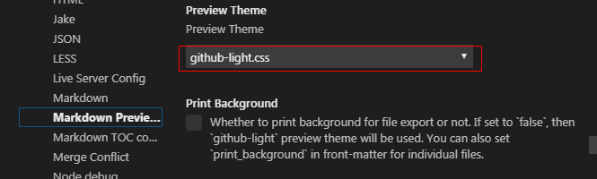

[TOC]

# VSCode学习笔记

## 配置

### settings

在vscode中按下Ctrl+Shit+P，然后输入settings,选择preferences:open settings(JSON)，打开配置文件

```json {.line-numbers}
{
    "python.pythonPath": "C:\\Users\\01295\\AppData\\Local\\Programs\\Python\\Python36\\python.exe",
    "python.jediEnabled": false,
    "C_Cpp.updateChannel": "Insiders",
    "markdown-pdf.executablePath": "C:\\Users\\01295\\AppData\\Local\\Google\\Chrome\\Application\\chrome.exe",
    "git.autofetch": true,
    
    "[markdown]": {
        "editor.formatOnSave": true,
        "editor.renderWhitespace": "all",
        "editor.quickSuggestions": {
            "other": true,
            "comments": true,
            "strings": true
        },
        "editor.acceptSuggestionOnEnter": "on"
    },
    "window.zoomLevel": 0,
    "markdown.extension.print.absoluteImgPath": false,
	"markdown-preview-enhanced.previewTheme": "newsprint.css",
	"markdown-toc.depthFrom": 2,
	"editor.minimap.enabled": true,
}
```

### snippets : c.json

点击左下角配置按钮 → user snippets → 选择c.json

```json {.line-numbers}
{
	"rt_sem_init":{
		"description": "信号量初始化",
		"prefix": "semi",
		"body": [
			"err=rt_sem_init(&$1,\"$2\",$3,RT_IPC_FLAG_FIFO);",
			"if(err != RT_EOK)",
			"{",
			"    rt_kprintf(\"trig $2 test sem init fail !\\n\");",
			"    RT_ASSERT(err == RT_EOK);",
			"}",
			"$0"
		]
	},
	"rt_sem_take : waiting forever":{
		"description": "永久等待一个信号量",
		"prefix": "semtwf",
		"body": [
			"rt_sem_take(&$1, RT_WAITING_FOREVER);",
			"$0"
		]
	},
	"rt_sem_take : waiting n ms":{
		"description": "等待信号量n ms",
		"prefix": "semtwnm",
		"body": [
			"err = rt_sem_take(&$1, MSec($2));",
			"$0"
		]
	},
	"rt_sem_trytake":{
		"description": "清空信号量",
		"prefix": "semtt",
		"body": [
			"while(rt_sem_trytake(&$1)==RT_EOK);",
			"$0"
		]
	},
	"rt_thread_init":{
		"description": "线程初始化:包括变量定义，初始化，线程入口函数创建",
		"prefix": "threadi",
		"body": [
			"#define RT_$1_THREAD_PRIO 21",
			"struct rt_thread $2_thread;",
			"rt_uint8_t $2_stack[1024];",
			"extern void $2_thread_entry(void *parameter);",
			"$0",
			"result = rt_thread_init(&$2_thread,\"$2\", $2_thread_entry, RT_NULL, (rt_uint8_t *)&$2_stack[0], sizeof($2_stack), RT_$1_THREAD_PRIO, 20);",
			"if (result == RT_EOK)",
			"{",
			"    rt_thread_startup(&$2_thread);",
			"    rt_kprintf(\"$2 thread start \\n\");",
			"}",
			"",
			"void $2_thread_entry(void *parameter)",
			"{",
			"    while(1)",
			"    {",
			"        rt_thread_delay(MSec(10));",
			"    }",
			"}"
		]
	},
	"variable : rt_semaphore":{
		"description": "定义一个信号量",
		"prefix": "vsem",
		"body": [
			"struct rt_semaphore $1;",
			"$0"
		]
	},
	"variable : err":{
		"description": "定义局部变量err",
		"prefix": "verr",
		"body": [
			"rt_err_t err;",
			"$0"]
	},
}
```

### snippets : markdown.json

点击左下角配置按钮 → user snippets → 选择markdown.json

```json {.line-numbers}
{
	"insert url":
	{
		"description": "插入超链接",
		"prefix": "url",
		"body": ["[$1]($2)"],
	},
	"insert png Fig":
	{
		"description": "插入图片",
		"prefix": "figp",
		"body": ["","{#fig:$2}","$0"],
	},
	"insert gif Fig":
	{
		"description": "插入图片",
		"prefix": "figg",
		"body": ["","{#fig:$2}","$0"],
	},
	"insert png Fig for wiki":
	{
		"description": "插入图片",
		"prefix": "figpw",
		"body": ["","{#fig:$2}","$0"],
	},
	"insert gif Fig for wiki":
	{
		"description": "插入图片",
		"prefix": "figgw",
		"body": ["","{#fig:$2}","$0"],
	},
	"code block of c":
	{
		"description": "插入c代码块",
		"prefix": "cc",
		"body": ["","```c {.line-numbers}","$1","```","$0"],
	},
	"code block of java":
	{
		"description": "插入java代码块",
		"prefix": "cj",
		"body": ["","```java {.line-numbers}","$1","```","$0"],
	},
	"code block of javascript":
	{
		"description": "插入javascript代码块",
		"prefix": "cjs",
		"body": ["","```javascript {.line-numbers}","$1","```","$0"],
	},
	"code block of html":
	{
		"description": "插入html代码块",
		"prefix": "ch",
		"body": ["","```html {.line-numbers}","$1","```","$0"],
	},
	"code block of batch":
	{
		"description": "插入batch代码块",
		"prefix": "cb",
		"body": ["","```batch {.line-numbers}","$1","```","$0"],
	},
	"code block of json":
	{
		"description": "插入json配置",
		"prefix": "cjson",
		"body": ["","```json {.line-numbers}","$1","```","$0"],
	},
	"insert bold text":
	{
		"description": "插入加粗文本",
		"prefix": "bt",
		"body": ["**$1**$0 "],
	},
	"insert todo list":
	{
		"description": "插入待办事项",
		"prefix": "td",
		"body": ["- [ ] "],
	},
}
```
### snippets中可以使用的变量

The following variables can be used:

	TM_SELECTED_TEXT The currently selected text or the empty string
	TM_CURRENT_LINE The contents of the current line
	TM_CURRENT_WORD The contents of the word under cursor or the empty string
	TM_LINE_INDEX The zero-index based line number
	TM_LINE_NUMBER The one-index based line number
	TM_FILENAME The filename of the current document
	TM_FILENAME_BASE The filename of the current document without its extensions
	TM_DIRECTORY The directory of the current document
	TM_FILEPATH The full file path of the current document
	CLIPBOARD The contents of your clipboard
	WORKSPACE_NAME The name of the opened workspace or folder

For inserting the current date and time:

    CURRENT_YEAR The current year
    CURRENT_YEAR_SHORT The current year’s last two digits
    CURRENT_MONTH The month as two digits (example ‘02’)
    CURRENT_MONTH_NAME The full name of the month (example ‘July’)
    CURRENT_MONTH_NAME_SHORT The short name of the month (example ‘Jul’)
    CURRENT_DATE The day of the month
    CURRENT_DAY_NAME The name of day (example ‘Monday’)
    CURRENT_DAY_NAME_SHORT The short name of the day (example ‘Mon’)
    CURRENT_HOUR The current hour in 24-hour clock format
    CURRENT_MINUTE The current minute
    CURRENT_SECOND The current second

For inserting line or block comments, honoring the current language:

    BLOCK_COMMENT_START Example output: in PHP /* or in HTML <!–
    BLOCK_COMMENT_END Example output: in PHP */ or in HTML -->
    LINE_COMMENT Example output: in PHP // or in HTML <!-- -->


```json {.line-numbers}

"c_header": {
        "prefix": "c_header",
        "body": [
            "/**",
            " * Copyright © 2019 Silvester. All rights reserved.",
            " * ",
            " * @author: Silvester",
            " * @date: $CURRENT_YEAR-$CURRENT_MONTH-$CURRENT_DATE ",
            " */",
            "#include <stdio.h>",
            "#include <stdlib.h>",
            "#include <string.h>",
            "",
            "int main() {",
            "    /****** your code ******/",
            "    $0",
            "    return 0;",
            "}"
        ]
        // "description": "Log output to console"
    }
```

```c {.line-numbers}

/**
 * Copyright © 2019 Silvester. All rights reserved.
 * 
 * @author: Silvester
 * @date: 2019-05-20 
 */
#include <stdio.h>
#include <stdlib.h>
#include <string.h>

int main() {
    /****** your code ******/
    
    return 0;
}
```


## 插件

### Markdown TOC

**功能：**
- 为标题增加序号
- 生成目录
- 最好选择1.5.5版本，可以实现一级标题不参与编号

**从二级标题开始编号**

在编写markdown文档时，经常会以一级作为首行，如果为此一级标题添加编号，则所有标题都会以1.开头，影响视觉，可以从二级标题开始进行编号，此时需要在settings中增加如下配置：

```json {.line-numbers}
"markdown-toc.depthFrom": 2,
```

**为标题插入编号**

点击右键 → 点击markdown sections:insert/update

*注：1.5.5版本插入目录时会错乱，建议使用markdown preview enhanced添加目录*

### Markdown preview enhanced

#### 为markdown文件添加目录

将光标定位到需要插入目录的位置 → 按Ctrl+Shift+P调出命令面板 → 输入toc → 选择Markdown preview enhanced:Ctreate TOC → 配置depthFrom=2，让目录从二级标题开始生成 → 点击Ctrl+S生成目录

# 配置

## settings

### 设置一个tab键对应的空格个数

在vscode中按下Ctrl+Shit+P → 输入indent → 选择indent using space → 选择4

*注：默认情况下vscode会根据文件类型自动配置空格个数*

### 用户设置

在vscode中按下Ctrl+Shit+P，然后输入settings,选择preferences:open settings(JSON)，打开配置文件

## snippets : c.json

点击左下角配置按钮 → user snippets → 选择c.json

## snippets : markdown.json

点击左下角配置按钮 → user snippets → 选择markdown.json

## snippets中可以使用的变量

The following variables can be used:

	TM_SELECTED_TEXT The currently selected text or the empty string
	TM_CURRENT_LINE The contents of the current line
	TM_CURRENT_WORD The contents of the word under cursor or the empty string
	TM_LINE_INDEX The zero-index based line number
	TM_LINE_NUMBER The one-index based line number
	TM_FILENAME The filename of the current document
	TM_FILENAME_BASE The filename of the current document without its extensions
	TM_DIRECTORY The directory of the current document
	TM_FILEPATH The full file path of the current document
	CLIPBOARD The contents of your clipboard
	WORKSPACE_NAME The name of the opened workspace or folder

For inserting the current date and time:

    CURRENT_YEAR The current year
    CURRENT_YEAR_SHORT The current year’s last two digits
    CURRENT_MONTH The month as two digits (example ‘02’)
    CURRENT_MONTH_NAME The full name of the month (example ‘July’)
    CURRENT_MONTH_NAME_SHORT The short name of the month (example ‘Jul’)
    CURRENT_DATE The day of the month
    CURRENT_DAY_NAME The name of day (example ‘Monday’)
    CURRENT_DAY_NAME_SHORT The short name of the day (example ‘Mon’)
    CURRENT_HOUR The current hour in 24-hour clock format
    CURRENT_MINUTE The current minute
    CURRENT_SECOND The current second

For inserting line or block comments, honoring the current language:

    BLOCK_COMMENT_START Example output: in PHP /* or in HTML <!–
    BLOCK_COMMENT_END Example output: in PHP */ or in HTML -->
    LINE_COMMENT Example output: in PHP // or in HTML <!-- -->


**使用案例** 

```json {.line-numbers}

"c_header": {
        "prefix": "c_header",
        "body": [
            "/**",
            " * Copyright © 2019 Silvester. All rights reserved.",
            " * ",
            " * @author: Silvester",
            " * @date: $CURRENT_YEAR-$CURRENT_MONTH-$CURRENT_DATE ",
            " */",
            "#include <stdio.h>",
            "#include <stdlib.h>",
            "#include <string.h>",
            "",
            "int main() {",
            "    /****** your code ******/",
            "    $0",
            "    return 0;",
            "}"
        ]
        // "description": "Log output to console"
    }
```

```c {.line-numbers}

/**
 * Copyright © 2019 Silvester. All rights reserved.
 * 
 * @author: Silvester
 * @date: 2019-05-20 
 */
#include <stdio.h>
#include <stdlib.h>
#include <string.h>

int main() {
    /****** your code ******/
    
    return 0;
}
```

# 插件

VS Code插件安装在如下地址：

```json {.line-numbers}
C:\用户\用户名\.vscode\extensions\
```
## vscode插件--C语言
1. C/C++ for Visual Studio Code

1. C/C++ Clang Command Adapter
    - 静态语法检测
    - 需要先安装LLVM

1. C++ Intellisense
    - 系统推荐

1. C-family Documentation Comments
    - 输入/**后回车自动添加注释的常用字段

1. sftp sync extension for VS Code
    - 个人觉得必备，在本地很云主机之间传输文件很方便

1. Code Runner
    - 可以直接运行单个cpp文件，对小型项目很有用

1. VSCode Color Info

    - 在写qss文件的时候特别好用，快速浏览qss的颜色
1. VSCode Comment Translate
    - 翻译注释
1. filesize package for Visual Studio Code

    - 在左下角显示文件的大小
1. vscode-icons

    - 换一些漂亮一点的图标
1. Better Comments

    - 使用*,!,?,TODO让注释更漂亮些
1. C/C++ GNU Global

    - 使用GNU Global为C/C++提供智能感知
1. C/C++ Project Generator

    - 自动生成工程目录和makefile，ctrl + shift + p -> Create C project
1. C/C++ Advanced Lint

    - 静态代码检测工具
1. Chinese (Simplified) Language Pack for Visual Studio Code

    - 汉化,ctrl+shift+p -> >configure Display Language ->选择 zh-cn
1. hexdump for VSCode
    - 查看二进制文件

## Markdown TOC

**功能：**
- 为标题增加序号
- 生成目录
- 最好选择1.5.5版本，可以实现一级标题不参与编号

**从二级标题开始编号**

在编写markdown文档时，经常会以一级作为首行，如果为此一级标题添加编号，则所有标题都会以1.开头，影响视觉，可以从二级标题开始进行编号，此时需要在settings中增加如下配置：

```json {.line-numbers}
"markdown-toc.depthFrom": 2,
```

**为标题插入编号**

点击右键 → 点击markdown sections:insert/update

*注：1.5.5版本插入目录时会错乱，建议使用markdown preview enhanced添加目录*

## Markdown preview enhanced

### 为markdown文件添加目录

将光标定位到需要插入目录的位置 → 按Ctrl+Shift+P调出命令面板 → 输入toc → 选择Markdown preview enhanced:Ctreate TOC → 配置depthFrom=2，让目录从二级标题开始生成 → 点击Ctrl+S生成目录

### 改变markdown显示格式

- 默认主题是：github-light.css，如下所示：

{#fig:markdown_preview_theme}

- 由于vscode的配置项较多，可以直接在settings的输入框中输入：markdown-preview-enhanced.previewTheme 找到对应的配置项

- github-light.css的路径是：

```json {.line-numbers}
C:\用户\用户名\.vscode\extensions\shd101wyy.markdown-preview-enhanced-0.3.13\node_modules\@shd101wyy\mume\styles\preview_theme

如：
C:\Users\01295\.vscode\extensions\shd101wyy.markdown-preview-enhanced-0.5.0\node_modules\@shd101wyy\mume\styles\preview_theme
```

- 可以用vscode打开css文件，markdown preview enhanced插件自带的.css文件是压缩过的，里面所有的空字符全部被删除，因此修改之前最好格式化一下文件，可下载CSS formatter插件进行格式化

- 修改完配置后，可以点击markdown preview enhanced 界面右上角的刷新按钮查看修改后的界面显示效果。

### help

- [官方帮助文档](https://shd101wyy.github.io/markdown-preview-enhanced/#/zh-cn/customize-css)
- [使用Visual Studio代码和Pandoc构建Markdown编辑器](https://thisdavej.com/build-an-amazing-markdown-editor-using-visual-studio-code-and-pandoc/)

## vscode-pandoc

### 环境搭建

### 生成pdf

**texlive安装** 

生成中文版本的pdf需要安装LaTeX。下载texlive安装包，大小约为3G，解压后右键点击install-tl-advanced.bat，选择以管理员身份运行。不同电脑安装时间不同，一般是1~4个小时

- [清华镜像](https://mirrors.tuna.tsinghua.edu.cn/CTAN/systems/texlive/Images/)，选择最新的.ISO文件下载接口

**自定义LaTeX模板**

使用下面命令将pandoc标准模板导出：

```batch {.line-numbers}
pandoc -D latex >d:/template.tex
```

在模板中找到"% if luatex or xetex"，在该语句下面插入如下代码，以便latex能够支持中文：

```latex {.line-numbers}
% SUPPORT for Chinese
  \usepackage[boldfont,slantfont,CJKchecksingle]{xeCJK}
  \usepackage{fontspec,xltxtra,xunicode}
  \defaultfontfeatures{Mapping=tex-text,Scale=MatchLowercase}

  \punctstyle{quanjiao}
  \setCJKmainfont{宋体} 
  \setCJKsansfont{KaiTi}
  \setCJKmonofont{SimSun}
```

**pandoc配置**

生成pdf需要使用xelatex引擎

```json {.line-numbers}
"pandoc.pdfOptString": "--template=D:/HOME/Templates/template.tex --pdf-engine=xelatex",
```

**参考**
[让pandoc输出pdf时支持中文](https://www.cnblogs.com/liuyangnuts/archive/2013/04/23/3038354.html)

**生成pdf**

按下Ctrl+Shit+P调出命令面板 → 输入“Pandoc Render”点击enter键 → 选择pdf文档 → 稍等片刻，pdf会在markdown所在目录下面生成pdf文件

# 参考资料

[使用VS Code打造完美的嵌入式IDE](https://blog.csdn.net/qq_34245464/article/details/100769643)